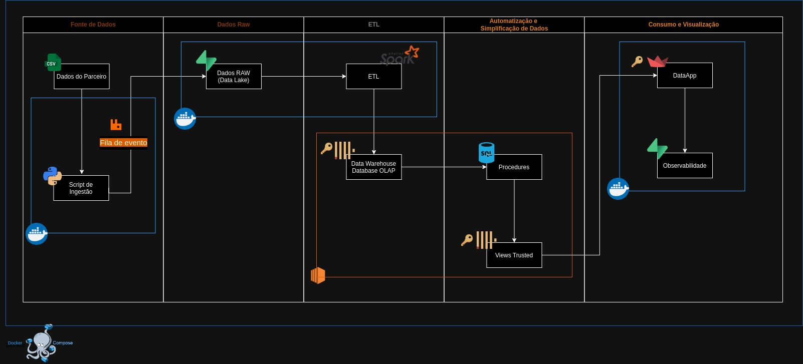
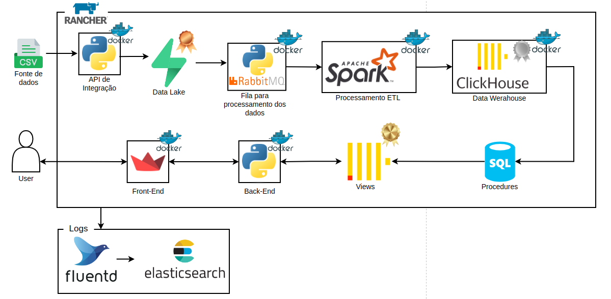
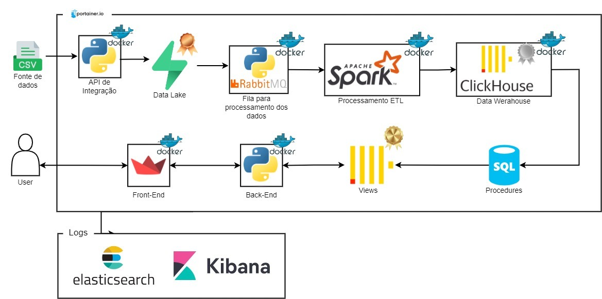
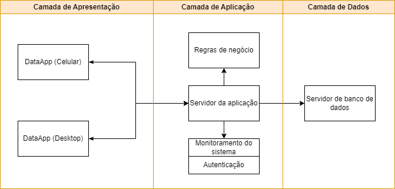
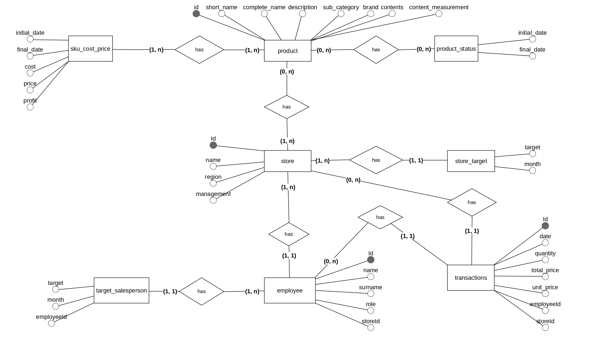
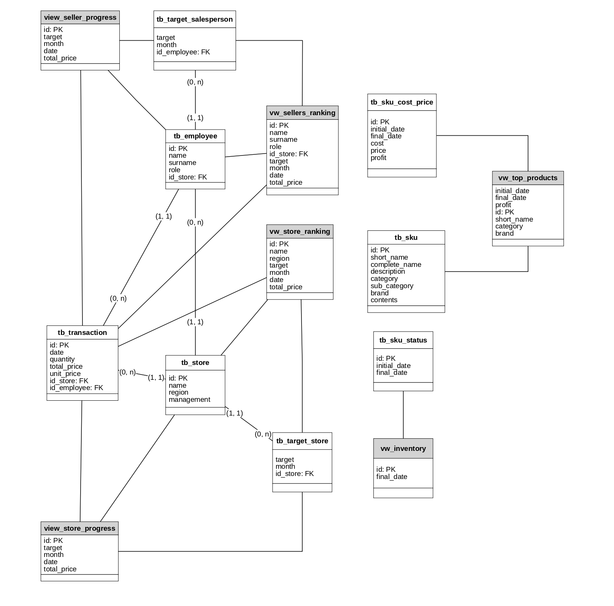
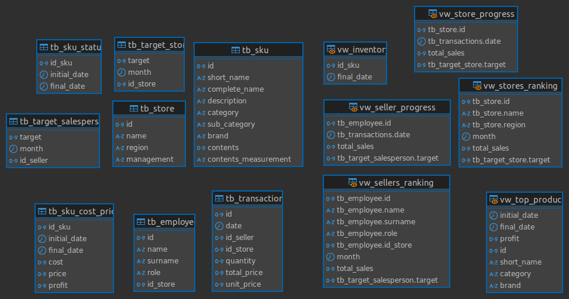
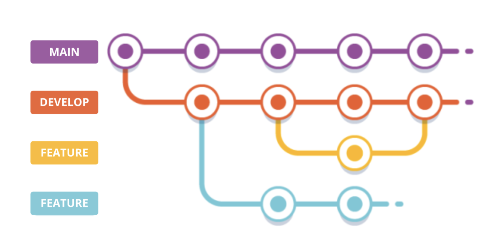
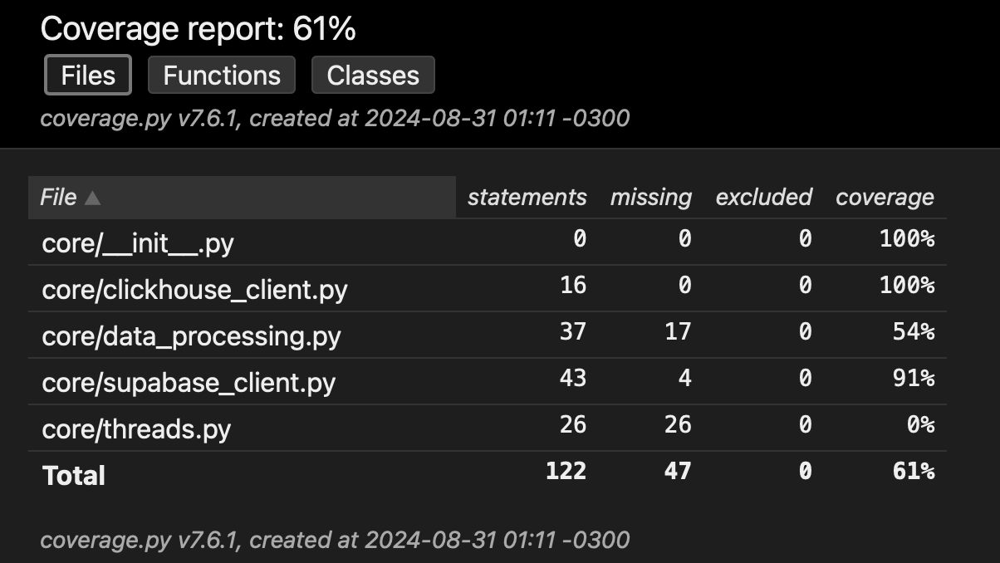
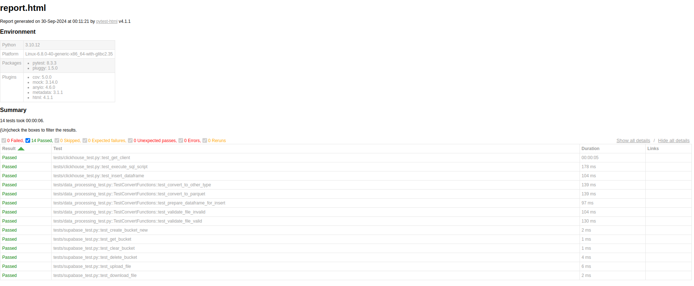

# Arquitetura de Dados

Documento baseado nos padrões TOGAF e IEEE.

# Sumário
- [1. Visão da Arquitetura](#1-visão-da-arquitetura)
  - [1.1 Problema](#11-problema)
  - [1.2 Stakeholders](#12-stakeholders)
  - [1.3 Restrições](#13-restrições)
  - [1.4 Escopo](#14-escopo)
- [2. Especificação de Requisitos](#2-especificação-de-requisitos)
  - [2.1 Requisitos Funcionais](#21-requisitos-funcionais)
  - [2.2 Requisitos Não Funcionais](#22-requisitos-não-funcionais)
  - [2.3 User Stories](#23-user-stories)
- [3. Arquitetura do Sistema](#3-arquitetura-do-sistema)
  - [3.1 Diagramação da Arquitetura - v1](#31-diagramação-da-arquitetura---v1)
  - [3.2 Diagramação da Arquitetura - v2](#32-diagramação-da-arquitetura---v2)
    - [3.2.1 Considerações de Escalabilidade](#321-considerações-de-escalabilidade)
  - [3.3 Diagramação da Arquitetura - versão final](#33-diagramação-da-arquitetura---versão-final)
  - [3.4 Arquitetura de 3 camadas](#34-arquitetura-de-3-camadas)
    - [3.4.1 Camada de aplicação - Servidor da aplicação](#341-camada-de-aplicação---servidor-da-aplicação)
  - [3.5 Features arquiteturais implementadas](#35-features-arquiteturais-implementadas)
    - [3.5.1 Algoritmo de recomendação de produtos para cross-sell](#351-algoritmo-de-recomendação-de-produtos-para-cross-sell)
    - [3.5.2 Modelo de recomendação de produtos substitutos](#352-modelo-de-recomendação-de-produtos-substitutos)
- [4. Modelagem de dados](#4-modelagem-de-dados)
  - [4.1 Modelo Conceitual](#41-modelo-conceitual)
    - [1. **Produto --> SKU Cost Price**](#1-produto---sku-cost-price)
    - [2. **Produto --> Product Status**](#2-produto---product-status)
    - [3. **Produto --> Store**](#3-produto---store)
    - [4. **Store --> Store Target**](#4-store---store-target)
    - [5. **Store --> Employee**](#5-store---employee)
    - [6. **Employee --> Target Salesperson**](#6-employee---target-salesperson)
    - [7. **Employee --> Transactions**](#7-employee---transactions)
    - [8. **Store --> Transactions**](#8-store---transactions)
  - [4.2 Modelo Lógico](#42-modelo-lógico)
  - [4.3 Modelo Físico](#43-modelo-físico)
    - [4.3.1 Script .sql](#431-script-sql)
    - [4.3.2 Diagrama uml](#432-diagrama-uml)
- [5. Integração e Interoperabilidade de Dados](#5-integração-e-interoperabilidade-de-dados)
  - [5.1 Nova pipeline de ETL](#51-nova-pipeline-de-etl)
- [6. Metadados](#6-metadados)
- [7. Gestão de Mudança de Artefatos](#7-gestão-de-mudança-de-artefatos)
- [8. Integridade dos Dados](#8-integridade-dos-dados)
- [9. Diagrama de fluxos e processos](#9-diagrama-de-fluxos-e-processos)
  - [9.1 Diagrama vendedor: realização de cross-sell com o cliente](#91-diagrama-vendedor-realização-de-cross-sell-com-o-cliente)
  - [9.2 Diagrama gerente: visualização de dados para tomada de decisões estratégicas](#92-diagrama-gerente-visualização-de-dados-para-tomada-de-decisões-estratégicas)
- [10. Considerações de Governança (Segurança)](#10-considerações-de-governança-segurança)
  - [10.1 Pontos de Segurança Identificados na Arquitetura](#101-pontos-de-segurança-identificados-na-arquitetura)
  - [10.2 Considerações Estratégicas e Planos de Ação](#102-considerações-estratégicas-e-planos-de-ação)
  - [10.3 Base de prospecção de tecnologia de Dashboard](#103-base-de-prospecção-de-tecnologia-de-dashboard)
- [11. Monitoramento e Gerenciamento](#11-monitoramento-e-gerenciamento)
  - [11.1 Pontos de Monitoramento](#111-pontos-de-monitoramento)
  - [11.2 Práticas para estratégia de gerenciamento](#112-práticas-para-estratégia-de-gerenciamento)
  - [11.3 Proposta de monitoramento](#113-proposta-de-monitoramento)
- [12. Padrão de Desenvolvimento](#12-padrão-de-desenvolvimento)
  - [12.1 Convenções de Codificação](#121-convenções-de-codificação)
    - [12.1.1 Implementação e Manutenção das Convenções](#1211-implementação-e-manutenção-das-convenções)
  - [12.2 Estrutura e Organização do Código](#122-estrutura-e-organização-do-código)
    - [12.2.1 Estrutura de Pastas](#1221-estrutura-de-pastas)
    - [12.2.2 Estrutura Interna dos Arquivos](#1222-estrutura-interna-dos-arquivos)
  - [12.3 Documentação Interna](#123-documentação-interna)
  - [12.4 Controle de Versão e Gitflow](#124-controle-de-versão-e-gitflow)
- [13. Relatório da cobertura de testes](#13-relatório-da-cobertura-de-testes)
  - [13.1 Cobertura Sprint 3](#131-cobertura-sprint-3)
  - [13.2 Cobertura Sprint 4](#132-cobertura-sprint-4)
- [14. Plano de Tarefas](#14-plano-de-tarefas)
  - [14.1 Descrição do plano de tarefas](#141-descrição-do-plano-de-tarefas)
    - [14.1.1 Tarefa 1 - Acessar andamento das vendas em relação à meta](#1411-tarefa-1---acessar-andamento-das-vendas-em-relação-à-meta)
    - [14.1.2 Tarefa 2 - Acessar quanto falta para entrar no pódio de melhores vendedores](#1412-tarefa-2---acessar-quanto-falta-para-entrar-no-pódio-de-melhores-vendedores)
    - [14.1.3 Tarefa 3 - Acessar quanto de comissão já recebeu no mês](#1413-tarefa-3---acessar-quanto-de-comissão-já-recebeu-no-mês)
    - [14.1.4 Tarefa 4 - Achar um top produto do mês](#1414-tarefa-4---achar-um-top-produto-do-mês)
    - [14.1.5 Tarefa 5 - Achar um produto substituto](#1415-tarefa-5---achar-um-produto-substituto)
    - [14.1.6 Tarefa 6 - Realizar uma venda cruzada](#1416-tarefa-6---realizar-uma-venda-cruzada)
    - [14.1.7 Tarefa 7 - Acessar histórico de vendas](#1417-tarefa-7---acessar-histórico-de-vendas)
    - [14.1.8 Tarefa 8 - Acessar funcionário do mês](#1418-tarefa-8---acessar-funcionário-do-mês)
  - [14.2. Resultado dos Testes](#142-resultado-dos-testes)
    - [14.2.1. Aspectos positivos](#1421-aspectos-positivos)
    - [14.2.2. Aspectos Negativos e Soluções Propostas](#1422-aspectos-negativos-e-soluções-propostas)
  - [14.3. Conclusões obtidas](#143-conclusões-obtidas)
- [15. Glossário de termos técnicos](#15-glossário-de-termos-técnicos)
  - [15.1 Termos gerais](#151-termos-gerais)
  - [15.2 Termos usados na arquitetura](#152-termos-usados-na-arquitetura)

# 1. Visão da Arquitetura

## 1.1 Problema

Uma grande varejista de cosméticos com mais de 200 lojas nas regiões Sul e Sudeste do Brasil, enfrenta desafios na comunicação entre seu setor corporativo e as lojas, incluindo gerentes e vendedores. Um dos principais problemas está relacionado aos modelos de remuneração variável, que são complexos e não são bem compreendidos pelos vendedores e gerentes. Essa falta de clareza e comunicação gera um alto índice de turnover, baixo engajamento dos vendedores, e uma performance geral abaixo do esperado.

Além disso, existe uma lacuna na visualização dos dados das vendas e produtos, não sendo claro quais os produtos mais vendidos, recomendações de cross-sell, somado a recomendações de substituição e outros.

## 1.2 Stakeholders

Os envolvidos no projeto desenvolvido englobam:
- Vendedores: Os vendedores são os usuários finais primários do DataApp, pois eles terão acesso direto à ferramenta e poderão visualizar suas próprias informações de desempenho e remuneração. Esses terão a oportunidade de acompanhar suas métricas individuais, entender melhor os modelos de remuneração e receber feedbacks e orientações para melhorar sua performance.

- Gerentes: Os gerentes são outros usuários primários do DataApp, pois eles utilizarão a ferramenta para monitorar e gerenciar o desempenho de sua equipe de vendas. Eles terão acesso a painéis de dados abrangentes, que lhes permitirão acompanhar métricas de vendas, taxas de conversão, satisfação do cliente e outros indicadores importantes. Com essas informações, os gerentes poderão tomar decisões mais embasadas, identificar tendências, diagnosticar problemas e implementar ações corretivas ou de desenvolvimento para sua equipe.

- Clientes: Embora os clientes não sejam usuários diretos do DataApp, eles são os beneficiários finais das melhorias de desempenho proporcionadas pela ferramenta. À medida que a equipe de vendas se torna mais eficiente e engajada, a experiência e a satisfação dos clientes tendem a melhorar. 

## 1.3 Restrições

Por se tratar de um DataApp, os dados tornam um fator para restrições no app, uma vez que nem todos podem estar disponíveis para qualquer usuário.

1) A classificação de todos os vendedores: As informações sobre a classificação geral de todos os vendedores serão acessíveis apenas aos gerentes. Cada vendedor terá acesso apenas à sua própria colocação em relação ao desempenho geral da equipe, sem visualizar as posições dos demais colegas. Essa abordagem garante a privacidade e evita comparações diretas entre os vendedores, promovendo um ambiente de trabalho mais colaborativo.

2) Rankeamento das lojas: O ranqueamento das lojas será visível apenas para os gerentes. Essa funcionalidade permitirá que os gerentes tenham uma visão clara do posicionamento de cada loja em relação à região, possibilitando a tomada de decisões estratégicas mais embasadas. O acesso restrito a esse tipo de informação garante que as decisões estratégicas sejam tomadas de forma responsável e alinhada com os objetivos da organização.

3) Desempenho de cada vendedor (comissão): As informações sobre a comissão e desempenho de cada vendedor estarão disponíveis apenas para o próprio vendedor e para o gerente responsável. Os vendedores poderão acompanhar seus próprios dados de desempenho, como volume de vendas, taxa de conversão e comissão, sem ter acesso aos dados dos colegas. Essa abordagem promove a privacidade e evita que os vendedores façam comparações diretas entre si, incentivando uma cultura de desenvolvimento individual e colaboração. Os gerentes terão acesso a esses dados para poder acompanhar, avaliar e fornecer feedback personalizado a cada membro da equipe de vendas.

4) Produtos recomendados para cross-sell: Essa funcionalidade será acessível para os vendedores, permitindo que eles visualizem sugestões personalizadas de produtos que podem ser adquiridos junto com o item principal. As recomendações serão baseadas em análises de dados de compras anteriores, preferências dos clientes e padrões de comportamento de consumo. Ao oferecer essas recomendações, a equipe de vendas poderá aumentar a taxa de conversão e o valor médio do pedido, beneficiando tanto a empresa quanto os clientes.

6) Produtos substitutos: Essa funcionalidade permitirá que os vendedores identifiquem alternativas aos produtos que os clientes estão interessados, podendo oferecer opções similares ou com características equivalentes. A disponibilidade dessas informações contribuirá para uma melhor assessoria aos clientes, proporcionando uma experiência de compra mais satisfatória e fortalecendo o relacionamento com a marca.

## 1.4 Escopo

A empresa deseja desenvolver um pipeline de dados com políticas de governança eficazes, que possibilite a criação de um DataApp para visualização de informações personalizadas sobre os vendedores e gerentes. Primeiramente, o DataApp irá melhorar a comunicação e o entendimento dos modelos de remuneração adotados pela empresa. Ao fornecer acesso a informações claras e transparentes sobre as estruturas de comissão e bônus, os funcionários poderão compreender melhor como sua performance e esforços são recompensados. Isso contribui para uma maior motivação e engajamento da equipe de vendas, uma vez que eles terão visibilidade sobre os fatores que influenciam sua remuneração.

Além disso, a ferramenta proporcionará insights valiosos sobre o desempenho dos vendedores e gerentes. Através de painéis de dados personalizados, a liderança poderá acompanhar métricas-chave, como volume de vendas, taxa de conversão, substituição de produtos e outros indicadores relevantes. Essa visibilidade aprimorada permitirá que a empresa identifique rapidamente áreas de melhoria, tendências e oportunidades de desenvolvimento.

# 2. Especificação de Requisitos

## 2.1 Requisitos Funcionais

**RF01** - O sistema deve permitir a visualização gráfica da projeção de vendas em diferentes períodos de tempo.

**RF02** - O sistema deve permitir que o vendedor e gerente visualizem suas vendas em relação a sua meta diária, mensal e anual,  de maneira percentual.

**RF03** - O sistema deve apresentar um gráfico que mostre detalhadamente o modelo de remuneração dos vendedores, incluindo comissões e outros componentes de forma individualizada.

**RF04** - O sistema deve fornecer recomendações automáticas de produtos que são frequentemente vendidos juntos.

**RF05** - O sistema deve apresentar de forma simples, quais produtos possuem a maior margem de lucro dentro da Cosmetics.Co.

**RF06** - O sistema deve possuir um ranking das vendas dos vendedores e das lojas.

**RF07** - O sistema deve possuir uma ferramenta de simulação de remuneração que permite aos vendedores e gerentes criar cenários personalizados.

**RF08** - O sistema deve permitir consultas em tempo real ao estoque disponível na loja.

## 2.2 Requisitos Não Funcionais

**RNF01** - O sistema deve garantir confiabilidade nos dados apresentados para vendedores e gerentes, permitindo apenas 3% de erros apresentados.

**RNF02** - A governança dos dados deve respeitar todas as regras da LGPD, além de priorizar que o privacy by design guie o funcionamento do sistema. 

**RNF03** - A interface deve ser intuitiva e de fácil entendimento, visto que busca atender público diverso de usuários. Os gráficos e informações dos dados devem ser claros o suficiente por si só para entendimento. 

**RNF04** - A interface deve ser responsiva para que possa ser acessada de diferentes dispositivos. Nota-se que o desenvolvimento deve ser mobile first.

**RNF05** - O sistema deve garantir disponibilidade de 70%, para que as consultas possam ser feitas durante horário de trabalho e atendimento dos clientes.

## 2.3 User Stories

**US01** - Como vendedor, eu quero visualizar uma projeção de vendas personalizada para diferentes períodos de tempo, a fim de  gerenciar melhor as minhas vendas e minhas metas.

**US02** - Como vendedor, eu quero acompanhar as minhas vendas em relação à minha meta mensal, a fim de saber o quão longe estou de atingi-la.

**US03** - Como vendedor, eu quero visualizar meu modelo de remuneração de forma gráfica, a fim de diferenciar e identificar os diferentes componentes de forma individualizada, como a comissão das vendas.

**US04** - ⁠Como vendedor, eu quero receber recomendações de quais produtos são frequentemente vendidos juntos na Cosmetics.Co, a fim de otimizar minhas indicações de produtos, e aumentar minhas vendas.

**US05** - ⁠Como vendedor, eu quero acessar, de forma intuitiva e clara, quais os produtos que possuem maior margem de lucro, a fim de direcionar as vendas e recomendá-los para os clientes, aumentando o lucro da empresa.

**US06** - Como vendedor, eu quero visualizar um ranking anônimo com as vendas do mês por parte dos colaboradores, a fim de me motivar para vender mais, e comparar meu desempenho com os demais.

**US07** - ⁠Como vendedor, eu quero simular a remuneração para diferentes cenários personalizados, a fim de melhorar o gerenciamento das minhas vendas e minhas metas.

**US08** - ⁠Como vendedor, gostaria de receber recomendações de produtos substitutos para um desejado, a fim de otimizar minhas recomendações para os clientes, aumentando minhas vendas

**US09** - Como gerente, eu quero visualizar uma projeção de vendas personalizada da minha unidade para diferentes períodos de tempo, a fim de  gerenciar melhor as vendas da unidade.

**US010** - ⁠Como gerente, eu quero acompanhar as vendas da minha unidade em relação à meta mensal da loja, a fim de saber o quão longe estamos de atingi-la.

**US011** - Como gerente, eu quero visualizar um ranking anônimo com as vendas do mês por parte das unidades da Cosmetics.Co, a fim de entender melhor o desempenho da minha unidade, e compará-lo  com as demais.

**US012** - Como gerente, eu quero simular a remuneração para diferentes cenários personalizados, a fim de melhorar o gerenciamento das vendas da minha unidade.

# 3. Arquitetura do Sistema

## 3.1 Diagramação da Arquitetura - v1

*Arquitetura V1:*


A arquitetura de dados foi desenvolvida para garantir a eficiência, escalabilidade e segurança no processamento e consumo de dados. Ela é dividida em várias etapas, começando pela Fonte de Dados, onde os dados são fornecidos por parceiros no formato CSV. Para ingestão, utilizamos um script em Python devido à sua simplicidade e à vasta biblioteca de suporte para manipulação de arquivos CSV e integração com filas de mensagens. O script lê os arquivos e envia os dados para uma fila de eventos implementada com RabbitMQ para o Data Lake, que garante a entrega confiável e ordenada dos eventos de forma assíncrona, desacoplando a ingestão do processamento subsequente. Todo esse processo é encapsulado em containers Docker, o que facilita a replicação do ambiente em diferentes infraestruturas.

Na Camada de Dados RAW, os dados brutos são armazenados em um Data Lake gerenciado pelo Supabase. Esta plataforma, similar ao S3 da AWS, foi escolhida por ser open-source e fácil de integrar, além de oferecer controle de acesso, versionamento e uma interface simples para gestão dos dados. O Supabase também é containerizado, garantindo consistência e escalabilidade no armazenamento.

O processo de ETL (Extração, Transformação e Carregamento) é realizado pelo Apache Spark, uma plataforma de processamento de dados distribuído altamente eficiente, capaz de transformar os dados brutos em estruturados, prontos para análise. Os dados transformados são armazenados no ClickHouse, um banco de dados OLAP de alto desempenho, otimizado para consultas analíticas em tempo real em grandes volumes de dados. Ambos os processos, ETL e Data Warehouse, são executados em containers Docker, garantindo um ambiente de execução isolado e consistente.

Na Automatização e Simplificação de Dados, utilizamos procedimentos armazenados no Data Warehouse para automatizar e simplificar consultas complexas. As Views Trusted são criadas para fornecer uma interface segura e simplificada aos dados transformados, garantindo a integridade das consultas. Estas operações também são configuradas dentro do container do Data Warehouse.

Para o Consumo e Visualização, desenvolvemos um DataApp utilizando Streamlit, que permite criar dashboards e aplicações web de forma rápida e simples, ideal para visualizações em tempo real. A integração com o Supabase oferece autenticação e ferramentas de observabilidade internas, eliminando a necessidade de infraestruturas adicionais para monitoramento de desempenho e segurança. Tanto o DataApp quanto o Supabase são compatíveis com Docker, permitindo fácil configuração, implantação e escalabilidade.

No contexto geral, optamos pelo uso extensivo de Docker e Docker Compose para encapsular todos os componentes do sistema, garantindo portabilidade e consistência no ambiente de desenvolvimento, teste e produção. Docker Compose orquestra todos os containers, facilitando a replicação do ambiente em diferentes máquinas e na nuvem.

O ClickHouse, utilizado como Data Warehouse, será implementado diretamente em uma instância EC2 na AWS. Os dados serão armazenados de forma persistente e confiável em um banco de dados PostgreSQL, garantindo a integridade e a durabilidade das informações, mesmo em cenários onde a instância EC2 possa ser temporariamente reiniciada ou substituída.

Por fim, a Governança de Dados será gerida através de um rigoroso controle de acesso, onde cada usuário terá permissões específicas. Este controle será feito por meio da autenticação no DataApp e pela criação de usuários e perfis no ClickHouse, assegurando que cada pessoa tenha acesso apenas às informações que lhe são pertinentes, garantindo a segurança e a privacidade dos dados.

## 3.2 Diagramação da Arquitetura - v2



Com a evolução das necessidades do projeto e a crescente demanda por um ambiente mais eficiente, escalável e seguro, a arquitetura foi reestruturada para incorporar tecnologias modernas e uma infraestrutura robusta. Mantendo a simplicidade dos processos fundamentais, a nova arquitetura adiciona uma camada de escalabilidade e gerenciamento automatizado, onde o Rancher desempenha um papel crucial na orquestração e no crescimento dinâmico de toda a infraestrutura. Assim todos os componentes são gerenciados de forma centralizada, garantindo escalabilidade automática conforme as demandas aumentam. Essa abordagem assegura que a arquitetura possa se ajustar de forma eficiente e flexível às novas exigências, proporcionando um ambiente preparado para lidar com volumes maiores de dados e acessos sem comprometer a performance ou a segurança.

Uma **fila RabbitMQ** foi adicionada na etapa anterior ao processo de ETL, com o objetivo de gerenciar o envio de dados entre a camada bronze e o serviço de ETL. O RabbitMQ é um *message broker* que permite que mensagens sejam enviadas para filas, onde ficarão armazenadas até serem consumidas pelo serviço que as consome. Isso facilita a comunicação assíncrona e desacoplada entre componentes, garantindo que mesmo se um serviço estiver temporariamente fora do ar, as mensagens não se percam e sejam processadas quando o serviço voltar.

A inclusão de uma nova **camada de backend** entre o streamlit e as views com os dados garante um nível de segurança mais alto, além de uma maior adaptabilidade quando pensamos na expansão de features do projeto, por exemplo. Nesse sentido, esse backend será desenvolvido em python, e será responsável pela comunicação entre a interface do usuário e as views, permitindo a consulta de dados, e alimentação dos dashboards.

Os **logs** da nossa solução - incluindo logs de container, aplicação e negócios - serão gerados, gerenciados e visualizados a partir da integração de 3 tecnologias: FluentD, ElasticSearch e Kibana. Nesse sentido, o **FluentD** é uma ferramenta de coleta e processamento de logs que agrega, transforma e envia os logs para o ElasticSearch, permitindo centralizar e padronizar o fluxo de dados de logs. O **ElasticSearch** é um mecanismo de busca e análise distribuído que armazena e indexa os logs recebidos, permitindo consultas rápidas e eficientes, facilitando a recuperação e análise de grandes volumes de dados de log. Por fim, o **Kibana** é uma ferramenta de visualização em que iremos criar dashboards interativos e gráficos a partir dos dados dos logs, facilitando a análise e o monitoramento.

### 3.2.1 Considerações de Escalabilidade

**1. Ingestão de Dados e Fila de Eventos**

Na nova arquitetura, a ingestão de dados continua por meio de arquivos CSV processados por um script Python, mas com melhorias significativas na escalabilidade. O uso de containers permite que o sistema distribua e gerencie automaticamente a ingestão e o envio dos dados para a fila de eventos RabbitMQ. A capacidade de escalabilidade horizontal foi aprimorada, permitindo a adição dinâmica de novos containers conforme o volume de dados cresce. Com isso, a ingestão agora é totalmente desacoplada e distribuída, garantindo o processamento simultâneo de múltiplos arquivos sem gargalos.

**2. Camada de Dados Brutos (Data Lake)**

O armazenamento de dados brutos no Data Lake utiliza o Supabase, uma plataforma open-source que foi integrado para garantir um armazenamento escalável, e o Rancher é responsável por orquestrar essa camada de armazenamento. Conforme o volume de dados armazenados cresce, o Rancher gerencia a criação de novos containers para o Supabase, assegurando que a capacidade de armazenamento esteja sempre ajustada às necessidades do sistema.
Com essa mudança, o Data Lake pode crescer horizontalmente sem interrupções, mantendo a performance e integridade dos dados brutos ao longo do tempo.

**3. Processamento ETL com Apache Spark**

Na nova arquitetura, o processamento ETL continua a ser conduzido pelo Apache Spark, que já é altamente eficiente em ambientes distribuídos. No entanto, o Rancher agora gerencia o provisionamento de recursos para o Spark, permitindo que novos nós de processamento sejam adicionados automaticamente conforme o volume de dados processados aumenta.
Desse jeito a infraestrutura de processamento pode se expandir ou contrair dinamicamente, garantindo que o tempo de processamento seja otimizado mesmo em cenários de carga elevada. Isso assegura que os dados transformados estejam prontos para análise em tempo hábil, independentemente do volume.

**4. ClickHouse: Data Warehouse com Alta Escalabilidade**

Uma das principais melhorias na nova arquitetura foi a integração do ClickHouse como Data Warehouse de alto desempenho, já otimizado para consultas OLAP. A escalabilidade foi aprimorada ao permitir a criação dinâmica de novos containers de ClickHouse conforme aumenta o volume de dados e o número de consultas. Isso garante alta performance e disponibilidade, mesmo durante picos de uso, distribuindo o ClickHouse em múltiplos nós para maior capacidade de processamento e resiliência.

**5. Visualização de Dados e Consumo**

Nessa arquitetura, o DataApp continua a ser a interface principal para visualização de dados, utilizando Streamlit para criar dashboards dinâmicos. A grande diferença agora é que o Rancher gerencia a escalabilidade desse componente de forma automatizada. O DataApp é executado em containers Docker, e Rancher permite que novas instâncias sejam criadas automaticamente para suportar um maior número de usuários simultâneos ou consultas mais complexas.Isso garante uma experiência fluida para os usuários, independentemente do número de acessos simultâneos, e facilita a expansão do DataApp conforme o sistema cresce.

**6. Monitoramento de Logs e Observabilidade**

Por fim, a gestão de logs e a observabilidade do sistema foram aprimoradas com a integração de Fluentd para coleta de logs e Elasticsearch para indexação e busca em tempo real. A escalabilidade horizontal desses componentes é facilitada, permitindo a criação de novos containers conforme o volume de dados de log aumenta. Isso garante que o sistema de observabilidade esteja sempre disponível para capturar e armazenar logs em tempo real, permitindo o monitoramento contínuo e a rápida detecção e correção de problemas antes que impactem os usuários.

A nova arquitetura garante escalabilidade com orquestração e monitoramento centralizados. Com políticas de auto-escalabilidade, os recursos são alocados automaticamente, distribuindo containers Docker entre diferentes nós de maneira eficiente. Essa abordagem horizontal permite que o sistema lide com grandes volumes de dados e múltiplas requisições simultâneas sem perda de desempenho. O balanceamento de carga é otimizado, garantindo alta disponibilidade e resiliência, adaptando-se tanto a infraestruturas na nuvem quanto on-premises.

## 3.3 Diagramação da arquitetura - versão final

</img>

Inicialmente, foram integradas as ferramentas FluentD e Rancher ao projeto, com o objetivo de garantir maior robustez e capacidade de gestão. No entanto, após uma análise mais aprofundada, constatou-se que a complexidade dessas soluções superava as necessidades reais do processo, resultando em uma sobrecarga tecnológica desnecessária. Dessa forma, decidiu-se simplificar a arquitetura, descontinuando o uso dessas tecnologias e substituindo o Rancher pelo Portainer, uma solução mais leve e mais adequada às exigências do projeto.

Considerando isso, o monitoramento de logs e observabilidade também foi alterado, passando a serrem gerados, gerenciados e visualizados a partir da integração de 2 tecnologias apenas: ElasticSearch e Kibana. Nesse sentido, o **ElasticSearch** é um mecanismo de busca e análise distribuído que armazena e indexa os logs recebidos, permitindo consultas rápidas e eficientes, facilitando a recuperação e análise de grandes volumes de dados de log. Já o **Kibana**, é uma ferramenta de visualização em que iremos criar dashboards interativos e gráficos a partir dos dados dos logs, facilitando a análise e o monitoramento.

## 3.4 Arquitetura de 3 camadas

A arquitetura de três camadas se baseia na organização dos aplicativos em três níveis distintos: a camada de apresentação, que serve como a interface do usuário; a camada do aplicativo, responsável pelo processamento de dados; e a camada de dados, onde os dados são armazenados e gerenciados. Cada camada pode operar de forma independente, permitindo que equipes de desenvolvimento diferentes trabalhem simultaneamente em cada nível e realizem atualizações ou ajustes sem afetar as outras camadas.

<div align="center">
    </img>
</div>

Conforme possível notar no diagrama, na primeira camada, a de Apresentação, estará a interface do DataApp. Com usabilidade intuitiva e design responsivo, a interface será capaz de se adaptar a diferentes dispositivos. Já na segunda camada, a de aplicação, é onde estarão as regras de negócio, limitações de usuários, autenticação e o back-end em si do sistema. Além disso, também será adicionado o módulo de monitoramento, a fim de garantir a observabilidade.

Por fim, na terceira, tem-se a camada de Dados, é onde estará o dervidor de dados, nele estará o supabase, o clickhouse, além do próprio banco de dados em si. Nela serão armazenados os dados da camada bronze, prata e ouro. A comunicação é feita através da camada de aplicação, que consulta no banco e envia para a camada de interface a informação desejada. 

Fonte: [IBM - Arquitetura de 3 camadas](https://www.ibm.com/br-pt/topics/three-tier-architecture)

### 3.4.1 Camada de aplicação - Servidor da aplicação

A autenticação com JWT (JSON Web Token) implementada no backend vai desempenhar um papel essencial na segurança do nosso projeto. Esse backend serve como uma ponte entre a aplicação desenvolvida em Streamlit e o banco de dados (BFF - Back-end for Front-end), para garantir que apenas usuários autorizados possam acessar as informações armazenadas sobre as lojas e vendas realizadas.

A funcionalidade de autenticação foi implementada para proteger o sistema e assegurar que, para cada operação realizada pela aplicação, o usuário precise estar devidamente autenticado. O uso do JWT permite que ao fazer login o usuário receba um token de acesso, que funciona como um passe de entrada para acessar funcionalidades protegidas do sistema. Esse token é único para cada usuário e tem um prazo de validade, o que garante maior segurança já que mesmo se alguém tiver acesso a esse token ele expira após certo tempo definido por nós.

No momento do login, o sistema compara as credenciais fornecidas (nome de usuário e senha) com os dados armazenados no nosso banco de dados ClickHouse. Caso o usuário já exista e a senha esteja correta, o token JWT é gerado e entregue ao usuário. Esse token deve será enviado em todas as interações seguintes com o backend, como quando o usuário tenta acessar dados para gerar os gráficos da aplicação. Dessa forma, o sistema sabe exatamente quem está tentando realizar as operações, assegurando que somente quem está devidamente autenticado possa prosseguir.

Outro aspecto importante dessa solução é o armazenamento seguro das senhas. Quando um novo usuário se cadastra, a senha não é salva no banco de dados de forma simples. Ela passa por um processo de criptografia, o que a torna ilegível mesmo que alguém tente acessá-la. Isso garante que os dados de login estejam protegidos contra tentativas de ataque.

No contexto do nosso projeto, onde é focado em governança de dados, essa autenticação é crucial. Ela consegue garantir que o acesso ao banco de dados e às informações sensíveis ocorra de forma controlada, permitindo apenas que usuários com permissão adequada realizem operações.

A autenticação com JWT representa um dos primeiros passos para garantir a segurança, é importante mencionar que essa autenticação é apenas a primeira implementação do backend, funcionando como a base da estrutura de segurança. O foco, neste momento, está em validar a identidade dos usuários e assegurar que somente pessoas autorizadas possam acessar as rotas protegidas e acessar os dados. No entanto, nas próximas sprints, planejamos expandir e aprimorar a funcionalidade do backend, como a implementação detalhada de obtenção de dados do banco de dados ClickHouse através deste backend.

## 3.5 Features arquiteturais implementadas

Somada as escolhas arquiteturais dos sistema, também foram desenvolvidos features que integram o DataApp. Essas buscavam abranger os requisitos definidos pela equipe e pelos stakeholders. Assim, a implementação dessas envolveu a escolha de determinadas tecnologias, conforme descrito nos tópicos seguintes.

### 3.5.1 Algoritmo de recomendação de produtos para cross-sell

Para a feature de recomendação de produtos para cross-sell foi escolhido o algoritmo Apriori. Essa é uma das técnicas mais conhecidas na mineração de dados para identificar padrões ocultos em grandes volumes de dados transacionais. Originalmente desenvolvido para analisar cestas de compras de clientes, o Apriori permite encontrar regras de associação, que são conexões significativas entre itens frequentemente adquiridos juntos em uma mesma transação. Por exemplo, ele pode revelar que "se um cliente compra batom, há 80% de chance de que ele também compre blush".

Essas regras são fundamentais para estratégias de marketing, como campanhas de cross-selling e promoções personalizadas, ajudando as empresas a aumentar suas vendas e a proporcionar uma experiência mais relevante e satisfatória para os clientes. No contexto atual, o algoritmo Apriori será empregado para construir a funcionalidade de cross-selling no DataApp, identificando automaticamente recomendações de produtos com base em comportamentos de compra reais.

Para mais informações de implementação, consulte o documento [produto.Rmd](./R%20notebooks/produto.Rmd/#6-análises-aprofundadas-voltadas-para-implementação-de-novas-features).

### 3.5.2 Modelo de recomendação de produtos substitutos

Já para a feature de recomendação de produtos substitutos foi escolhido o uso da tecnologia de NLP - Natural Language Processing. Por meio do processamento do conteúdo disponível dos produtos, o modelo calcula a similaridade com outros e permite a recomendação daquele que pode substituir determinado cosmético que esteja em falta.

Para essa aplicação, foi escolhido o BERT, modelo de processamento de linguagem natural consolidado no mercado, ele usa de embedings em seu funcionamento, sendo baseado principalmente em contexto. Assim como diversos outros modelos da mesma categoria, BERT utiliza da tecnologia *Transformes* (usada também por AI generativas como Gemini e ChatGPT). Seu diferencial se dá pelo entendimento mais profundo do texto, por ser bidirecional, não dependente da sequência esquerda para a direita, conforme outros modelos.


<center>

Figura - Arquitetura BERT

<div align="center">
  </img>
</div>

</center>

O fluxo de processamento é feito pelas etapas seguintes:

- Concatenação de colunas: por o modelo funcionar através de contexto, é necessário a formação de frases com os dados disponíveis. Neste sentido, é feita a junção de colunas do dataset de produtos - nome, nome completo, descrição, categoria e subcategoria.

- Conversão em vetor: assim como grande parte dos modelos de NLP, ocorre a vetorização das frases. Esses vetores serão processados posteriormente na rede neural.

- Cálculo da similaridade do cosseno: para determinar quais produtos são mais similares a fim de fazer a recomendação, é usado como métrica o cálculo da similaridade do cosseno. A partir desse resultado, é listado os 20 produtos mais similares, ou seja, aqueles que resultaram os maiores valores após a realização do cálculo.

Fonte: [BERT - Ebook DeepLearning](https://www.deeplearningbook.com.br/modelo-bert-para-processamento-de-linguagem-natural/)

# 4. Modelagem de dados
## 4.1 Modelo Conceitual



### 1. **Produto --> SKU Cost Price**
   - **Cardinalidade à Esquerda** (Produto):
     - (1, n): Cada produto deve ter pelo menos um SKU Cost Price, mas pode ter muitos ao longo do tempo.
   - **Cardinalidade à Direita** (SKU Cost Price):
     - (1, n): Cada SKU Cost deve estar associado a pelo menos um produto inicialmente, mas pode estar associado a muitos produtos.

### 2. **Produto --> Product Status**
   - **Cardinalidade à Esquerda** (Produto):
     - (1, n): Cada produto deve ter pelo menos um Product Status, mas pode ter muitos ao longo do tempo.
   - **Cardinalidade à Direita** (Product Status):
     - (1, 1): Um Product Status deve estar associado a somente um produto já que trata de um produto especifico em um periodo de tempo especifico.

### 3. **Produto --> Store**
   - **Cardinalidade à Esquerda** (Produto):
     - (0, n): Um produto pode estar disponível em várias lojas ou em nenhuma loja.
   - **Cardinalidade à Direita** (Store):
     - (1, n): Uma loja deve ter pelo menos um produto, mas pode ter muitos produtos.

### 4. **Store --> Store Target**
   - **Cardinalidade à Esquerda** (Store):
     - (1, n): Cada loja deve ter pelo menos uma Store Target definida, mas pode ter várias ao longo do tempo.
   - **Cardinalidade à Direita** (Store Target):
     - (1, 1): Uma Store Target deve estar associado a somente um loja já que trata de uma loja especifica em um periodo de tempo especifico.

### 5. **Store --> Employee**
   - **Cardinalidade à Esquerda** (Store):
     - (1, n): Cada loja deve ter pelo menos um funcionário, mas pode ter muitos funcionários.
   - **Cardinalidade à Direita** (Employee):
     - (1, 1): Cada funcionário deve estar associado a somente uma loja.

### 6. **Employee --> Target Salesperson**
   - **Cardinalidade à Esquerda** (Employee):
     - (1, n): Cada funcionário deve ter pelo menos uma meta de vendas associada a ele, mas pode ter várias metas ao longo do tempo.
   - **Cardinalidade à Direita** (Target Salesperson):
     - (1, 1): Uma Employee Target deve estar associado a somente um funcionário já que trata de uma funcionário especifico em um periodo de tempo especifico.

### 7. **Employee --> Transactions**
   - **Cardinalidade à Esquerda** (Employee):
     - (0, n): Um funcionário pode não ter realizado nenhuma transação, mas pode ter realizado várias.
   - **Cardinalidade à Direita** (Transactions):
     - (1, 1): Cada transação deve estar associada a somente um funcionário.

### 8. **Store --> Transactions**
   - **Cardinalidade à Esquerda** (Store):
     - (0, n): Cada loja pode não ter nenhuma transação, mas pode ter várias.
   - **Cardinalidade à Direita** (Transactions):
     - (1, 1): Cada transação deve estar associada a somente uma loja.

## 4.2 Modelo Lógico



O modelo lógico é uma evolução do modelo conceitual previamente apresentado. Durante a fase de modelagem conceitual, foram identificadas as principais entidades e os relacionamentos entre elas, levando em consideração as necessidades do negócio e os requisitos funcionais. A partir desse ponto, na modelagem lógica, essas entidades foram transformadas em tabelas na nossa camada prata, cada uma com seus atributos específicos. Essas tabelas são estruturadas com três colunas principais: "data da ingestão", "dados" e "tag". Além disso, os relacionamentos foram ajustados para refletir a forma como os dados serão efetivamente armazenados e acessados.

O modelo lógico inclui várias tabelas, cada uma representando uma entidade. As principais tabelas incluem:

- **tb_employee**: Contém informações sobre os funcionários, como ID, nome, sobrenome, cargo, e a loja à qual estão associados.
- **tb_store**: Representa as lojas, com detalhes como ID, nome, região e gerenciamento.
- **tb_transaction**: Armazena informações sobre as transações, incluindo a data, quantidade, preço total, preço unitário, e as referências à loja e ao funcionário envolvidos.
- **tb_sku**: Detalha os produtos, incluindo o ID, nomes (curto e completo), descrição, categoria, subcategoria, marca e conteúdos.
- **tb_sku_cost_price**: Mantém o histórico de custos e preço dos SKUs ao longo do tempo.
- **tb_sku_status**: Registra o status dos SKUs, monitorando datas de início e fim.

Além dessas tabelas, o modelo lógico inclui seis views (`vw_`) que são usadas para relatórios e análises de dados na nossa camada gold que serve de consumo e visualização no nosso DataApp, como ranking de vendedores e lojas, produtos mais vendidos, e inventário, segue descrição das nossas views definidas:

1. **vw_sellers_ranking**: Esta view oferece um ranking dos vendedores com base em seu desempenho, considerando o alvo (`target`) mensal, e as vendas realizadas (`total_price`). Ela combina informações do vendedor, como nome e sobrenome, com o total vendido no mês.

2. **vw_store_ranking**: Esta view apresenta um ranking das lojas, ordenando-as com base em sua performance em relação ao alvo (`target`) e às vendas totais (`total_price`). Isso permite comparar a eficácia de cada loja dentro da região e ao longo de períodos específicos.

3. **vw_top_products**: A view "Top Products" lista os produtos de maior desempenho, identificando aqueles que geraram maior lucro (`profit`) durante um período. Ela ajuda a identificar os produtos mais rentáveis e os que mais contribuíram para o faturamento da empresa.

4. **vw_inventory**: Esta view monitora o inventário, fornecendo um resumo das datas de início e fim para cada SKU no sistema. Ela auxilia na gestão do estoque, permitindo uma visão clara dos produtos disponíveis em qualquer ponto no tempo.

5. **view_seller_progress**: A view "Seller Progress" acompanha o progresso dos vendedores em relação ao alvo estabelecido para eles, considerando o mês e o total de vendas (`total_price`). É útil para avaliar o desempenho individual de cada vendedor ao longo do tempo.

6. **view_store_progress**: Semelhante à view anterior, esta monitora o progresso das lojas, comparando o total de vendas realizadas com o alvo mensal. Ela ajuda na análise de desempenho das lojas em diferentes períodos e sob diversas condições econômicas.

## 4.3 Modelo Físico
A modelagem física foi desenvolvida com foco na estrutura de armazenamento e de buscas do CLickHouse, o que tem como objetivo otimizar o armazenamento e a consulta dos dados, seguindo uma estrutura em camadas. A camada prata é representada por tabelas que armazenam os dados processados e consolidados, servindo como uma base intermediária para análises detalhadas. Essas tabelas foram projetadas para garantir eficiência na ingestão e no processamento de dados. Além disso, foram criadas views que compõem a camada ouro. Essas views agregam, transformam e organizam os dados da camada prata para facilitar a análise e o consumo pelos usuários finais. A camada ouro, portanto, oferece uma forma simplificada e otimizada para consultas analíticas, aproveitando a performance do ClickHouse para fornecer insights rápidos e precisos para consulta.

A transição do modelo lógico para o modelo físico é um passo importante no processo da modelagem do banco de dados, em que a estrutura abstrata definida no modelo lógico é refinada e adaptada para implementação real em um sistema de gerenciamento de banco de dados (Dbeaver). Durante a fase de modelagem lógica, foram estabelecidas as tabelas, seus atributos e os relacionamentos entre elas, focando na integridade dos dados e na clareza das interações entre as diferentes partes do sistema. 

Este formato de modelagem, é composto por um diagrama UML e um conjunto de scripts SQL que definem as tabelas e as views. A modelagem física não só descreve a estrutura das tabelas, mas também os tipos de dados através de uma simbologia própria. 

### 4.3.1 Script .sql  
A criação do banco de dados é coberta pelas queries presentes [neste arquivo .sql](modelagem_fisica.sql).

### 4.3.2 Diagrama uml


- ferramenta utilizada: dbeaver

# 5. Integração e interoperabilidade dos dados

ETL (Extract, Load, Transform) é um processo de integração de dados que envolve três etapas principais: extração (coleta de dados de diversas fontes), transformação (limpeza, formatação e processamento para atender às necessidades do sistema de destino) e carga (inserção dos dados transformados em um banco de dados ou sistema de armazenamento). O ETL é amplamente usado para consolidar dados em data warehouses ou plataformas de análise.

Nesse sentido, a fim de garantir a integridade dos dados, foi decidido por utilizar 2 processos de ETL integrados a pipeline de processamento, que realizam tarefas distintas. O primeiro faz a verificação dos nomes dos arquivos e colunas usando a tecnologia do Pydentic, atuando na camada bronze da aplicação.

O Pydantic é uma biblioteca de Python voltada para a validação de dados e a criação de modelos de dados fortemente tipados. Ela utiliza os recursos de tipagem do Python (type hints) para definir esquemas de dados e permite validar esses dados automaticamente com base nas regras especificadas. Isso facilita a manutenção da consistência dos dados, uma vez que qualquer entrada fora do padrão gera exceções claras, que podem ser tratadas ou corrigidas.

A escolha da ferramenta foi feita por diversas razões, sendo a principal a validação robusta e automática dos dados antes mesmo de inseri-los no Data WareHouse, já que o projeto lida com grande volume desses. Além disso, a ferramenta é simples e performática, e possui uma sintaxe clara que possibilita um código bem legível.

Foi utilizada para modelar as entidades do sistema, como as tabelas de Employee, SkuDataset, SkuCost, e Store. Cada modelo Pydantic define os campos esperados e as regras de validação para esses dados. Esses modelos são aplicados principalmente na validação de arquivos CSV e outros formatos de dados, garantindo que os dados estejam no formato correto antes de serem processados e inseridos no sistema.

Em relação à implementação, foi utilizada a função validate_file, que faz a verificação de cada linha do arquivo de entrada com base nos modelos Pydantic, utilizando o método model_validate. Enquanto percorre as linhas do Dataframe, é acionado o método de validação para verificar se o formato condiz com o Schema pré-estabelecido, de forma que caso haja inconsistência no arquivo recebido, interrompa o processamento. Dessa forma, é possível garantir que os dados que serão processados posteriormente pelos nossos ETLs utilizem apenas dados nos formatos corretos, melhorando a performance e qualidade do nosso pipeline de dados.

Já o segundo, tinha o objetivo de transformar os dados para serem consumidos na camada gold, atuando então entre a camada bronze e a prata. O processamento se dava na criação e correção de colunas, completamente dependentes das visualizações que a camada seguinte permitiria na interface. Os processos realizados foram:
- Limpeza de valores nulos: para garantir que nenhum valor nulo interferisse em análises ou dados incompletos poluíssem a camada gold, é feita a limpeza em todos os datasets;
- Remoção de funcionários inativos: não é utilizado em nenhuma funcionalidade da aplicação os registros de funcionários inativos, nesse sentido, pensando em otimização de recursos, é feita a remoção desses;
- Criação de coluna pra a variável *preço_unitário* (na tabela transaction): como os preços são dados pelo total da quantidade comprada, é necessário a criação de uma coluna com o preço unitário que cada produto de fato foi vendido;
- Criação da tabela **cost_price**, provinda de um cruzamento entre *sku_price* e *sku_cost*: o sistema conta com a funcionalidade de visualização de lucro, nesse sentido notou-se a necessidade de uma tabela para o registro de preço, custo e a criação de uma coluna referente ao cálculo de lucro com base nessas duas anteriores;
- Remoção de valores e coluna *data_final* (na tabela sku_status): outra funcionalidade não utilizada são os produtos inativos, assim, foram removidos os registros que possuiam dados na coluna data_final, e a coluna em si posteriormente.
- Seleção dos últimos valores do inventário (na tabela inventory): para selecionar os registros de estoque mais atualizados, foram coletados os últimos registros de cada produto por loja;
- Renomear as colunas pra inglês, garantindo padronização: algumas colunas nos dados brutos estão e português, enquanto outras em inglês, assim decidiu-se padronizar todas em inglês;
- Insert no ClickHouse.

É importante ressaltar que esse ETL é acionado diariamente pela madrugada, as 2:00 horas da manhã, tendo em vista que é um horário que possui menor custo e menos atividade na plataforma, o que garante que os dados estarão sempre atualizados no DataApp. 

## 5.1 Nova pipeline de ETL

Somado ao ETL citado anteriormente, existem outros dois processos que ocorrem paralelamente uma vez por semanas, uma vez que identificou-se não haver alto grau de variação dos dados, além de a espera do acúmulo de dados poder ser benéfico para a análise:

- Criação de tabela cross-sell: para a feature de recomendação de produtos vendidos em conjuntos, criou-se uma pipeline para o processamento e armazenamento desses dados.
  - Remover os valores nulos;
  - Aplicar o algoritmo de cross-sell;
  - Salvamento das colunas de id de cada produto e o array com a recomendação dos produtos vendidos mais frequentemente juntos.

- Criação da tabela de produto substituto: para a feature de recomendação de produtos substitutos, criou-se uma pipeline para o processamento e armazenamento desses dados.
  - Remoção de valores nulos;
  - Aplicação do modelo NLP;
  - Salvamento das colunas de id de cada produto e o array com a recomendação dos produtos substitutos.

Por fim, mensalmente um ETL paralelo aos demais também é executado para o cálculo de projeção de vendas. Como esse exige recurso computacional abrangente e uma pouca frequência de atualização, possui pipeline separado do restante. O processo conta com:
- Filtragem dos dados de transação por colaborador ativo; 
- Cálculo de série temporal para cada um dos colaboradores;
- Criação da tabela para armazenamento dos resultados de série temporal.

# 6. Metadados

Metadados são dados que fornecem informações sobre outros dados, funcionando como uma descrição que contextualiza e organiza informações de maneira a facilitar sua compreensão e uso. Eles podem ser vistos como "dados sobre dados". Ajudam a descrever a qualidade, a estrutura e as características dos conjuntos de dados, permitindo uma melhor análise e interpretação.

Para o projeto a aparição desses se dá no armazenamento dos arquivos na etapa inicial em que são inseridos no Supabase. A partir da tecnologia é possível visualizar os metadados de cada um dos arquivos presentes no bucket. Além disso, a própria aplicação tem mecanismos para o registro de metadados, como o caso do uso na tabela *working_data*. O armazenamento dos dados no ClickHouse conta com duas colunas referentes a essas informações: date, que se refere ao dia que o dado foi processado e armazenado e a tag, que se refere a tabela original que o dado derivou.

# 7. Gestão de Mudança de Artefatos

O gerenciamento das alterações de artefatos é um processo importante para garantir a qualidade do produto, as alterações devem passar antes por um conjunto de processos e políticas capazes de proteger a integridade e a completude das documentações entregues.

Para ser realizada uma alteração nos artefatos é necessário que seja feito os seguintes passos.

**Definição:**
deve ser descrito o artefato que será alterado, com uma descrição breve do que será alterado.

**Motivo:**
deve ser descrito o motivo para a alteração, para permitir que seja realizada a análise do trade off para tomada de decisão.

**Mapeamento:**
deve ser realizado o rastreio de todas as documentações e implementações que serão impactadas para garantir que a mudança não irá comprometer a integridade do projeto e das documentações. Dependendo da alteração, deverá também ser definida as áreas de negócios que serão impactadas por ela.

**Plano de Implementação:**
definir como será feita a alteração, esse plano será o principal responsável pela aprovação ou reprovação da solicitação de alteração de artefatos, assim como permitirá a definição de meios para o acompanhamento.

**Responsáveis:**
deve ser listado todos os responsáveis para a realização de cada alteração, para ser capaz de direcionar a responsabilidade da execução e auxiliar no acompanhamento. 

**Solicitação de Mudança:**
com todas as informações levantadas, será realizada uma solicitação de alteração, que passará pela aprovação das áreas responsáveis, sendo possível a solicitação ser aprovada, recusada ou necessitar de ajustes. Caso seja solicitado ajustes, será necessário que a solicitação, após ajustada, volte novamente ao processo de aprovação.

**Implementação:**
ao ser aprovada uma solicitação, será executado o plano de implementação, com os prazos e métodos de acompanhamento definidos, entrando no workflow dos responsáveis pela sua execução.

Seguindo corretamente esse processo, é possível garantir que as alterações estarão de acordo com as decisões dos stakeholders, assim como será possível reduzir os riscos de comprometer a integridade dos artefatos em alterações futuras do projeto.


# 8. Integridade dos Dados

Para garantir a integridade dos dados desde o momento inicial de ingestão até o momento de consumo final nas visualizações dos usuários, serão efetuados processos pré-estabelecidos de tratamento e transformação, resultando em um aumento da qualidade e da consistência dos dados, comparados ao estado inicial de recebimento deles.

Nesse contexto, os processos a serem efetuados são:

*Conversão para parquet:* os dados serão otimizados para garantir uma maior performance e diminuição do tamanho necessário para armazená-los. Assim como uma grande melhora nas consultas, reduzindo drásticamente o tempo de resposta ao buscar posteriormente os dados armazenados no clickhouse. Além de performance, a escolha do parquet contribui para a consistência dos dados, minimizando a chance de corrupção ou inconsistências durante o armazenamento e a consulta;

*Tratamento de dados:* haverá uma padronização do tamanho das colunas pré-estabelecidas juntamente com os nomes da tabelas importadas e suas colunas, identificando se os arquivos armazenados no data lake respeitam as estruturas necessários para o nível prata/ouro. Como adicional, serão realizados tratamentos avançados, verificando os tipos dos dados de cada coluna e seus dados, e se conferem com os padrões definidos. Também serão realizadas tratativas para garantir que sempre que novos dados forem ingeridos no sistema, apenas dados novos que não estejam contidos no data warehouse sejam inseridos, protegendo contra duplicidade de dados;

*Transformações de dados*: Serão realizadas conversões nos dados nulos para dados utilizáveis de forma não danosa, garantindo os resultados corretos, e a criação de novas colunas com base no cruzamento de dados relevantes que serão necessárias para features de visualização, por exemplo. Além disso, serão removidos dados sensíveis não essenciais, que não fazem parte das consultas dos usuários, garantindo o cumprimento das normas de LGPD mapeadas no plano de governança do projeto.

Para garantir a conformidade definida, serão realizadas auditorias periódicas de acordo com a disponbilidade dos integrantes do grupo, com apoio dos instrutores de computação,  negócios, e orientadora. Dessa forma, tornando possivel a garantia de que os processos de integridade dos dados estão sendo realizados corretamente, assim como os resultados estão de acordo com as necessidades da organização.

Por fim, as modelagens, arquiteturas e políticas de governança são reconhecidas como documentos "vivos", e deverão ser revisadas periódicamente em detrimento de novas demandas e insights, a fim de garantir uma melhora contínua no plano de integridade dos dados utilizados.

# 9. Diagrama de fluxos e processos

## 9.1 Diagrama vendedor: realização de cross-sell com o cliente


**Descrição do Fluxograma:**

Este fluxograma apresenta o processo de cross-selling na loja CosmeticCo, descrevendo como a interação entre cliente, vendedor e uma ferramenta de apoio chamada DataApp pode resultar em uma experiência de compra mais completa e potencialmente mais lucrativa para a empresa.

<u>Cliente:</u> O processo se inicia com o cliente entrando na loja da CosmeticCo em busca de um produto específico. Após chegar à loja, o cliente procura um vendedor para auxiliá-lo na localização do item desejado.

<u>Vendedor:</u> O vendedor, ao ser abordado, ajuda o cliente a encontrar o produto que ele deseja. Nesse momento, o vendedor tem a opção de seguir dois caminhos:

*   finalizar a venda apenas com o produto que o cliente procurou inicialmente
*   explorar a oportunidade de realizar uma venda cruzada (cross-sell), sugerindo um produto adicional que complemente a compra original.

<u>DataApp:</u> Caso o vendedor decida explorar o cross-sell, ele acessa o DataApp, uma ferramenta projetada para oferecer, entre outras funcionalidades, recomendações de produtos complementares. Essas sugestões são baseadas em análises do comportamento de compra de outros clientes, que adquiriram itens adicionais em conjunto com o produto em questão. O DataApp utiliza esses dados, aliados a estratégias de venda previamente definidas, para identificar o produto complementar mais adequado que o vendedor pode recomendar ao cliente.

<u>Cliente (Interação com a sugestão):</u> Após receber a recomendação do DataApp, o vendedor faz a sugestão ao cliente, oferecendo o produto adicional. O cliente, então, decide se aceita ou não a sugestão. Esse ponto é uma bifurcação importante no processo:

* Se o cliente recusar a recomendação, ele procede apenas com a compra do produto inicial e o processo de venda é finalizado.
* Se o cliente aceitar a sugestão do vendedor, ele adquire ambos os produtos, concluindo o processo com uma compra mais robusta.

## 9.2 Diagrama gerente: visualização de dados para tomada de decisões estratégicas


**Descrição do Fluxograma:**

Este fluxograma descreve um processo de tomada de decisões estratégicas, baseado na visualização de dados, que envolve o uso de uma ferramenta de análise para acompanhar o desempenho da loja e da equipe de vendas. O fluxo é estruturado de forma a orientar o gerente na identificação de métricas importantes e na tomada de decisões com base em informações objetivas.

<u>Gerente:</u> O processo inicia-se com o gerente percebendo um aumento significativo nas vendas da sua loja no mês atual. Reconhecendo esse resultado positivo, o gerente manifesta interesse em saber se a loja está próxima de atingir a meta de vendas estabelecida.

Para obter uma visão mais detalhada, o gerente decide consultar o DataApp, uma ferramenta que lhe fornece dados precisos sobre o progresso da loja.

<u>DataApp:</u> Ao acessar o DataApp, o gerente visualiza que a loja está próxima de alcançar a meta mensal de vendas. Essa informação confirma o bom desempenho, mas o gerente decide aprofundar sua análise para obter uma compreensão mais completa da situação. Ele verifica outras análises disponíveis no sistema e descobre que sua loja ocupa a primeira posição no ranking regional, o que reforça o sucesso obtido.

Diante dessa informação, o gerente resolve examinar como o desempenho individual dos vendedores está contribuindo para esse resultado geral. O DataApp aponta que um vendedor específico teve uma performance acima da média, destacando-se dos demais.

<u>Decisão do Gerente:</u> Com esses dados em mãos, o gerente é levado a um momento decisório, sendo apresentado a ele duas opções:
*  Ele pode optar por não agir com base nas informações obtidas, encerrando o processo. 
* Como também pode optar em fornecer um feedback positivo ao vendedor que apresentou um desempenho excepcional. Ao optar por essa abordagem, o gerente não apenas reconhece o esforço do colaborador, mas também reforça uma cultura de reconhecimento e motivação dentro da equipe.

<u>Vendedor:</u> Ao receber esse feedback positivo, o vendedor sente-se valorizado pelo seu desempenho superior, o que, por sua vez, aumenta o seu engajamento e compromisso com os objetivos da loja. Esse reconhecimento contribui para o desenvolvimento de um ambiente de trabalho mais motivador e orientado para resultados.

# 10. Considerações de Governança (Segurança)

As considerações de segurança foram realizadas com base na arquitetura desenvolvida para o projeto. Nesta análise, foram identificados pontos críticos que podem comprometer a integridade dos dados e a segurança geral do sistema. Além disso, foram sugeridas melhorias essenciais que devem ser implementadas para mitigar esses riscos.

## 10.1 Pontos de Segurança Identificados na Arquitetura

1. **Armazenamento dos Dados Brutos no Bucket**
   - Os dados são inicialmente armazenados em um Bucket para posterior processamento. Este ponto apresenta um risco de segurança significativo, pois atualmente não há mecanismos de autenticação adequados implementados.

2. **Processamento dos Dados pelo Apache Spark**
   - O processamento dos dados ocorre em um cluster do Apache Spark. As principais considerações de segurança aqui incluem o controle de acesso ao cluster e a proteção do tráfego de dados na rede.

3. **API de Comunicação da Aplicação com os Usuários**
   - A segurança desta API deve priorizar a autenticação, autorização e a implementação de limitação de taxa (rate limiting) para prevenir abusos e ataques.

## 10.2 Considerações Estratégicas e Planos de Ação

1. **Criptografia dos Dados Armazenados e em Trânsito**
   - Os dados armazenados no Bucket devem ser criptografados para garantir sua segurança. O plano de ação inclui a implementação de criptografia assimétrica para proteger os dados em repouso. Além disso, é fundamental garantir a segurança dos dados em trânsito na rede, seja no tráfego entre o Bucket e o banco de dados ClickHouse, ou no tráfego de dados da API. A utilização de criptografia SSL/TLS é recomendada para garantir a segurança dos dados em trânsito.

2. **Revisão e Implementação de Políticas de Acesso**
   - O acesso ao Bucket, ao ClickHouse, ao Cluster Apache Spark e à API deve ser rigorosamente controlado para garantir a segurança da aplicação. A proposta inclui a criação de grupos de segurança distintos para cada componente da arquitetura, assegurando que apenas usuários autorizados tenham acesso. Para a API, recomenda-se a implementação do OAuth 2.0 para garantir que somente usuários autenticados possam acessar os recursos da aplicação.

3. **Monitoramento e Auditoria Contínuos**
   - Deve-se implementar políticas robustas para monitorar o acesso e o uso de todos os serviços na arquitetura. Além disso, é crucial configurar alertas para atividades suspeitas e realizar auditorias periódicas para identificar e corrigir eventuais vulnerabilidades de segurança.

## 10.3 Base de prospecção de tecnologia de Dashboard

Para selecionar a ferramenta ideal para a construção visual da aplicação, foi realizada uma análise criteriosa dos requisitos funcionais, com o objetivo de garantir que o framework escolhido atenda de forma eficaz às principais necessidades da aplicação. Os requisitos funcionais a serem considerados incluem:

* **RF1, RF2 e RF3:** Esses requisitos demandam que a ferramenta selecionada possua alta flexibilidade e facilidade de uso para a criação de gráficos e dashboardsons, considerando que esses elementos serão o conteúdo central do DataApp e irão compor as páginas principais da aplicação;

* **RF4, RF5, RF6, RF7, RF8:** Esses requisitos exigem que a ferramenta escolhida ofereça integração simplificada com frameworks de banco de dados e modelos de análise estatística, visto que as principais funcionalidades da aplicação envolvem o processamento de grandes volumes de dados para exibição no DataApp, proporcionando insights e informações para os funcionários.

Diante dessa análise, a ferramenta **Streamlit** se apresenta como uma escolha adequada para a construção do DataApp, pois atende aos requisitos funcionais da aplicação de forma ágil e eficiente. Desenvolvida em Python, o que facilita a integração com bibliotecas utilizadas na análise de dados, como Pandas e Scikit-Learn, o Streamlit permite criar interfaces interativas para visualização de dados sem a necessidade de conhecimentos avançados em desenvolvimento web. Ademais, a ferramenta se destaca por sua capacidade de gerar gráficos e dashboards interativos de forma ágil e de fácil desenvolvimento, proporcionando visualizações dinâmicas e responsivas para facilitar a análise de dados tanto pelo computador do gerente quanto pelo celular dos vendedores, o que garante ao DataApp o acesso por meio de todos os dispositivos.

Além disso, o Streamlit se destaca no contexto deste projeto por simplificar o processo de deploy do DataApp, permitindo que ele seja rapidamente implementado diretamente nas lojas, em servidores locais ou computadores de fácil acesso. Tal simplicidade garante que as informações de peso relevante, como projeções de vendas, metas e modelos de remuneração, estejam sempre disponíveis aos vendedores no ponto de venda, impulsionando essa operção. Dessa forma, o Streamlit possibilita a adoção do DataApp sem a necessidade de uma infraestrutura complexa, proporcionando uma implementação rápida e eficiente que atende às necessidades imediatas das lojas e seus colaboradores.

# 11. Monitoramento e Gerenciamento

Tendo em vista que a aplicação busca realizar o tratamento e armazenamento de dados além de apresentar de forma personalizada interfaces com informações geradas por esses dados, nota-se a importância da presença de uma infraestrutura de monitoramento e gerenciamento da aplicação.

## 11.1 Pontos de Monitoramento

O monitoramento da aplicação tange o uso de tecnologias para o acompanhamento de processos que ocorrem durante seu funcionamento. Compreendeu-se a existência de dois ambientes diferentes, o sistema de processamento dos dados e pipeline ETL e o DataApp em si. Nesse sentido, o mapeamento ocorreu de forma paralela para ambos. 

Foram mapeados os seguintes pontos (PM) para o aplicativo:

- **PM1 - DataApp:** Login de usuário na plataforma;
- **PM2 - DataApp:** Tentativa de acesso à páginas restritas;
- **PM3 - DataApp:** Consulta de dados nas views que o aplicativo permite;
- **PM4 - DataApp:** Cálculo de projeção de vendas e comissão;
- **PM5 - DataApp:** Recomendações de produtos para cross-sell;
- **PM6 - DataApp:** Recomendações de produtos substitutos;
- **PM7 - DataApp:** Identificação de produtos no estoque e sua localidade;

Já para a pipeline de dados, entendeu que os pontos de monitoramento eram:

- **PM1 - Pipeline:** Ingestão dos dados por meio de FastAPI;
- **PM2 - Pipeline:** Conversão dos arquivos em Parquet;
- **PM3 - Pipeline:** Armazenamento no datalake - supabase;
- **PM4 - Pipeline:** Transformação de dados para as 3 colunas primárias;
- **PM5 - Pipeline:** Armazenamento dos dados no datawarehouse - clickhouse;
- **PM6 - Pipeline:** Transformação dos dados para as views;
- **PM7 - Pipeline:** Armazenamento dos views - clickhouse;

## 11.2 Práticas para estratégia de gerenciamento

A fim de garantir o gerenciamento e monitoramento da aplicação de forma eficaz, algumas medidas foram estabelecidas para a construção desse processo. Notou-se que haveria a necessidade da definição de objetivos claros, traduzidos em KPIs, que serviriam como indicadores de desempenho para medir a eficácia da pipeline de dados, assim como o tempo de execução, taxa de erro e qualidade dos dados. Esses poderiam ser capturados com logs e exibidos em dashboards.

Além disso, planos de escalonamento, somados a alertas, garantiriam medidas de contenção rápidas, em casos de erro no sistema. Em adicional, com foco no gerenciamento de mudanças, entendeu-se que também seria importante o controle de versão tanto da pipeline, quanto dos arquivos processados, esses atuando juntamente aos testes automatizados, para garantir updates seguros para o sistema.

## 11.3 Proposta de monitoramento

De forma a aplicar as estratégias definidas, planejou-se o uso da ferramenta ElasticSearch, uma vez que essa permiti a coleta, armazenamento e análise de grandes volumes de dados em tempo real, com a capacidade de indexar logs, métricas e eventos. A atuação dele se refletiria em:

1. Logs de Eventos: incluindo ações do usuário, erros e outros eventos relevantes.

2. Triggers e Webhooks: acionamento de webhooks que enviam dados para serviços de monitoramento sempre que uma operação específica ocorrer.

3. Monitoramento de Performance: monitoramento de consultas SQL para identificar lentidões e otimizar o desempenho.

4. Autenticação e Segurança: registros de tentativas de login e ações de usuários.

5. Alertas: alertas baseados em eventos críticos ou métricas em que ocorre a notificação em tempo real sobre problemas na aplicação.

O monitoramento seria realizado por meio da integração das tecnologias ElasticSearch, MongoDB e Kibana. O fluxo de dados ocorreria com a aplicação enviando os logs diretamente ao ElasticSearch, que, após o recebimento, processaria e transformaria os logs conforme necessário. Nesse processo, filtros seriam aplicados e os dados seriam formatados de maneira adequada para a visualização no Kibana.

# 12. Padrão de Desenvolvimento

## 12.1 Convenções de Codificação
Seguir as melhores práticas de codificação é essencial para garantir um código limpo, eficiente e fácil de manter. Nesse sentido, utilizamos o PEP8 como guia de estilo de código, com o objetivo de utilizar um padrão de escrita que facilite a leitura e a manutenção do nosso código em python ao longo do tempo.

O PEP8 define um conjunto de regras e boas práticas para a escrita de código, e, essencialmente, seguiremos as seguintes práticas:
- <b>Indentação:</b> A indentação é muito importante quando falamos em python, e é necessário utilizar 4 espaços por nível de indentação, sendo que o uso de tabs deve ser evitado. Além disso, é importante ressaltar que os cocmentários tamb;em devem seguir essa regra.
- <b> Tamanho das Linhas:</b>  Limitação das linhas a no máximo 79 caracteres para melhorar a legibilidade, evitando a necessidade de scroll horizontal.
- <b> Espaços em Branco:</b>  Evitar espaços em branco desnecessários, especialmente em torno de operadores e dentro de parênteses.
- <b> Linhas em Branco:</b> Evitar linhas em branco desnecessárias; Sempre adicionar uma linha em branco ao final do arquivo; Entre funções dentro de classe, adicionar 1 espaço, e entre funções fora de classe, 2 espaços.
- <b> Nomenclatura:</b> 
    - Variáveis e funções devem utilizar snake_case;
    - As classes devem seguir o padrão CamelCase.
- <b> Comentários:</b>  Podemos ter comentários no código, mas eles devem ser claros e objetivos - não explicar o que o código faz, mas qual o objetivo final dele. Devem começar com letra maiuscula, e ser escritos em inglês - assim como todo o resto do código.
- <b>Importações:</b>  Devem ser feitas sempre no início do arquivo, e em linhas separadas (uma em cada linha, quando vem de fontes diferentes). Além disso, importações não utilizadas devem ser removidas.

### 12.1.1 Implementação e Manutenção das Convenções
Para garantir que o código em python produzido para o projeto siga as práticas definidas anteriormente, adotaremos medidas tanto para o código que já foi produzido, como para o que será produzido daqui pra frente.

Nesse sentido, em relação ao código produzido anteriormente à criação deste documento, haverá um intensivo de revisão/refatoração a ser realizado em cima de todo o código passado, para que ele esteja pronto para receber atualizações/manutenção daqui pra frente. (sprint 1 - sprint 3).

Porém, para o código a ser produzido daqui pra frente, além das boas práticas que serão seguidas organicamente pelos integrantes do grupo, utilizaremos de algumas ferramentas facilitadoras para garantir a eficiência da implementação das convenções definidas. 

O uso dessas ferramentas vai nos ajudar muito na garantia de que o padrão PEP8 seja utilizado de forma consistente, no código de todos os integrantes do grupo.

São essas ferramentas:

- <b>Pylint e flake8</b> - será utilizado para automatizar a verificação de estilo de código/ análise de código na pipeline de CI, barrando a subida de códigos que não atendam aos nossos requisitos de qualidade (definidos anteriormente);
- <b>Prefect</b> - será utilizado para automatizar tarefas de manutenção e monitoramento do código;
- <b>Extensões na IDE</b> - serão utilizadas extensões de análise de código python integradas à IDE de cada integrante, a fim de identificar problemas desde a fase inicial de desenvolvimento, em tempo real.

## 12.2 Estrutura e Organização do Código

### 12.2.1 Estrutura de Pastas
A seguir está a  estrutura de diretórios de código do projeto, que estão na pasta raiz src:

```
2024-2A-T03-ES11-G01/
│
├── src/      
│   ├── data_pipeline/
│   │   ├── core/
│   │   ├── infra/
│   │   ├── sql/
│   │   ├── tests/
├── README.md
├── app.py
├── makefile
├── poetry.lock
├── pyproject.toml
```

* Os arquivos de implementação internos aos diretórios não serão discriminados pois estão sujeitos a mudanças recorrentes, não havendo necessidade didática de especificação neste documento.

### 12.2.2 Estrutura Interna dos Arquivos
Nossa estrutura está seguindo uma arquitetura modular. Ou seja, a organização interna dos arquivos de código, além de seguir as convenções do PEP8 abordadas anteriormente, deve refletir a modularidade do código, seguindo o princípio de Single Responsibility Principle (SRP) do SOLID. Funções e classes que desempenham papéis específicos devem ser isoladas em arquivos e módulos próprios, promovendo a reutilização de pedaços de código, fácil manutenção e implementação de novas features.
Com essa organização, o código se torna mais legível, fácil de navegar, e adequado para crescer à medida que as sprints passam.


## 12.3 Documentação Interna
A documentação interna do código basicamente vai consistir em como vamos utilizar da funcionalidade de fazer comentários dentro do nosso código para facilitar o entendimento dele, através de um documento autodescritivo e facilmente navegável. Essa prática vai ser essencial para garantir que o projeto seja facilmente compreensível e mantido, tanto por nós, como pelos professores que nos acompanham, como os parceiros. 

Inicialmente, gostaria de retomar o tópico "Comentários" da seção de "Convenções de codificação" no início deste documento:

 > *"Comentários: Podemos ter comentários no código, mas eles devem ser claros e objetivos - não explicar o que o código faz, mas qual o objetivo final dele. Devem começar com letra maiuscula, e ser escritos em inglês - assim como todo o resto do código."*

Os comentários internos serão utilizados para explicar partes do código que podem não ser óbvias à primeira vista, sendo claros e sucintos, sem duplicar o que já é evidente no próprio código. Isso para não gerarmos poluição no código, e acabarmos obtendo o efeito oposto do esperado.

Os comentários se limitam, essencialmente, aos seguintes objetivos:

1. Explicação de lógica complexa: Se uma parte do código envolve cálculos, algoritmos, ou lógicas complexas;
2. Motivação para escolhas de design: Se adotarmos uma solução técnica não usual ou não intuitiva, explicar o porquê da decisão.
3. Advertências ou futuras melhorias: Se implementarmos algo que foi feito de forma pouco eficiente, por motivo de falta de tempo ou outro recurso, sinalizar algo que pode ser melhorado ou que precisa de atenção futura.

## 12.4 Controle de Versão e Gitflow
O projeto está sendo desenvolvido de forma colaborativa utilizando este repositório no GitHub, com o Git como sistema de controle de versão. Para garantir uma organização eficiente e padronizada do código, adotamos o fluxo de trabalho Git Flow, estruturado nas seguintes branches:
- main: Esta branch representa a versão estável e de produção do software. Ela é atualizada ao final de cada sprint, após a conclusão e revisão dos desenvolvimentos planejados. Toda versão entregue ao cliente ou disponibilizada publicamente é oriunda desta branch.
- develop: É a branch principal de desenvolvimento contínuo, onde todas as novas funcionalidades e correções são integradas. Serve como base para a criação das branches de features, fix, docs e outros ajustes.
- Branches de feature, fix e docs: Estas branches são criadas a partir da branch develop e seguem um fluxo específico de trabalho:
    - Feature: Para desenvolvimento de novas funcionalidades;
    - Fix: Para correção de bugs;
    - Docs: Para atualizações de documentação.

<div align="center">
  
</div>

O ciclo de trabalho se dá com a criação de uma branch a partir da develop, onde o desenvolvedor realiza suas alterações. Após a conclusão da tarefa, é criado um Pull Request (PR) entre a branch e a develop, e, após passar pelos processos de revisão (que serão especificados posteriormente), o PR é aprovado, e a branch é mergeada de volta na develop.

O processo de revisão dos PRs segue o seguinte fluxo:
1. No momento de criação das tarefas na sprint planning, utilizando o github projects, definimos 1 ou 2 revisores para cada task, dependendo do nível de complexidade, tamanho e prioridade da tarefa;
2. Ao criar o PR, o responsável envia no nosso grupo do whatsapp o link do PR, seguido de uma marcação com o nome dos revisores, solicitando a revisão;
3. O status da task é definido como "To review";
4. Os ciclos de revisão são realizados, em que os comentários são feitos e corrigidos até chegar em uma versão aceitável para entrega;
5. Caso o PR tenha como destino a branch develop, a esteira de CI é rodada em cima da branch;
6. O PR é aprovado e, caso passe com sucesso em todas as etapadas da esteira de CI, é mergeado para a develop;
7. O status da task é definido como "Done".


# 13. Relatório da cobertura de testes

O pytest foi escolhido como framework de testes por ser leve, simples e altamente extensível, além de permitir uma fácil integração com diversos plugins, como o pytest-html para a geração de relatórios e o pytest-cov para calcular a cobertura dos testes. Além disso, ele suporta tanto testes unitários quanto testes funcionais, permitindo uma abordagem mais abrangente na verificação do sistema.

## 13.1 Cobertura Sprint 3

<div align="center">
  
</div>

## 13.2 Cobertura Sprint 4

<div align="center">
  
</div>

# 14. Plano de tarefas

A fim de mapear as principais tarefas a serem realizadas pelos usuários no nosso sistema, foi definido um plano de tarefas, baseado nos Requisitos Funcionais e nos fluxos da interface.
Dito isso, segue as tarefas definidas:

| RF   | Tarefa                                        |
|------|-----------------------------------------------|
| RF02 | Acessar andamento das vendas em relação à meta|
| RF06 | Acessar quanto falta para entrar no Ranking	 |
| RF03 | Acessar quanto de comissão já recebeu no mês	 |
| RF05 | Achar um top produto do mês	                 |
| RF04 | Achar um produto substituto	                 |
| RF04 | Realizar uma venda cruzada		                 |
| RF01 | Acessar histórico de vendas		               |
| RF02 | Acessar funcionário do mês		                 |

A fim de mapear cada etapa dentro dessas tarefas, foi criada uma planilha que destrincha o passo-a-passo de cada uma delas, contendo o resultado final esperado, e os resultados parciais de cada etapa. 

Essa planilha será utilizada, também, para a realização dos testes de usabilidade do sistema. Assim, permitindo que possamos não só acompanhar o andamento da implementação dessas tarefas, mas obter insights sobre a usabilidade da nossa interface e a o quão fácil e intuitivo são nossos fluxos.

Planilha com template: [Plano de tarefas](https://docs.google.com/spreadsheets/d/1I63LQy6fE9ReCr_I0xU9axsOeF0RzqgW/edit?usp=sharing&ouid=104565061157055751171&rtpof=true&sd=true)

## 14.1 Descrição do plano de tarefas

### 14.1.1 Tarefa 1 - Acessar andamento das vendas em relação à meta

* **Comando:** Suponha que você é um vendedor, e quer acompanhar o andamento das duas vendas. Utilize o site para descobrir quanto falta para você atingir a meta do mês.

* **Critério de Sucesso:** O usuário conseguiu acessar a página "Home", identificar qual o gráfico responsável pela visualização das vendas e descrever corretamente qual o valor de suas vendas atuais e quanto falta para atingir as metas de venda.

* **Relevância:** Validar se o RF02 está devidamente implementado ao projeto.

* **Status de implementação:** Desenvolvido e pronto para testes com uso de dados simulados (não integrado ao banco de dados).

### 14.1.2 Tarefa 2 - Acessar quanto falta para entrar no pódio de melhores vendedores

* **Comando:** Suponha que você é um vendedor, e quer comparar seu desempenho com o resto da empresa. Utilize o site para descobrir sua posição no ranking de vendas, e quanto (em reais) falta para você entrar no ranking.

* **Critério de Sucesso:** O usuário conseguiu acessar a página "Home", identificar qual o gráfico responsável pela visualização de sua colocação no ranking e descrever corretamente qual sua posição em relação aos demais funcioários, quais são os vendedores que representam as 3 maiores posições e quanto (em reais) falta para ele vizualizar sua posição no pódio.

* **Relevância:** Validar se o RF06 está devidamente implementado ao projeto.

* **Status de implementação:** Desenvolvido e pronto para testes com uso de dados simulados (não integrado ao banco de dados).

### 14.1.3 Tarefa 3 - Acessar quanto de comissão já recebeu no mês

* **Comando:** Suponha que você é um vendedor, e quer gerenciar quanto você receberá esse mês. Utilize o site para descobrir quanto de comissão já recebeu até agora.

* **Critério de Sucesso:** O usuário conseguiu acessar a página "Home", identificar qual o gráfico responsável pela visualização de seu montante a receber e descrever corretamente qual o valor recebido bruto esperado ao final do mês, quais fatores de venda compõem esse valor e o quanto cada um representa em relação ao total acumulado.

* **Relevância:** Validar se o RF03 está devidamente implementado ao projeto.

* **Status de implementação:** Desenvolvido e pronto para testes com uso de dados simulados (não integrado ao banco de dados).

### 14.1.4 Tarefa 4 - Achar um top produto do mês

* **Comando:** Suponha que você é um vendedor, e quer vender um produto com alto lucro, para ganhar uma comissão maior. Utilize o site para achar um produto da categoria de "Rosto" que esteja nos top produtos com maior taxa de lucro.

* **Critério de Sucesso:** O usuário conseguiu acessar a página "Insights de Vendas", identificar o carrosel de produtos mais vendidos, filtrar por categoria rosto e indicar ao menos um produto dessa categria presente nesse componente.

* **Relevância:** Validar se o RF05 está devidamente implementado ao projeto.

* **Status de implementação:** Desenvolvido no frontend e no backend, mas ainda não integrado.

### 14.1.5 Tarefa 5 - Achar um produto substituto

* **Comando:** Suponha que você é um vendedor, está no meio de um atendimento, e o cliente quer um produto que está fora de estoque. Utilize o site para achar um outro produto que possa substituí-lo com a maior precisão.

* **Critério de Sucesso:** O usuário conseguiu acessar a página "Insights de Vendas", identificar o campo de pesquisa de pprodutos substitutos, buscar por um produto da loja e descrever ao menos 3 produtos semelhantes encontrados.

* **Relevância:** Validar se o RF04 está devidamente implementado ao projeto.

* **Status de implementação:** Desenvolvido no frontend e no backend, mas ainda não integrado.

### 14.1.6 Tarefa 6 - Realizar uma venda cruzada

* **Comando:** Suponha que você é um vendedor, está no meio de um atendimento, e quer tentar influenciar o cliente a comprar mais itens. Utilize o site para achar um outro produto para fazer uma venda cruzada com o que seu cliente já selecionou.

* **Critério de Sucesso:** O usuário conseguiu acessar a página "Insights de Vendas", identificar o campo de pesquisa de vendas cruzadas, buscar por um produto da loja e descrever ao menos 3 produtos que são comumente vendidos junto ao item pesquisado.

* **Relevância:** Validar se o RF04 está devidamente implementado ao projeto.

* **Status de implementação:** Desenvolvido no frontend e no backend, mas ainda não integrado.

### 14.1.7 Tarefa 7 - Acessar histórico de vendas

* **Comando:** Suponha que você é um vendedor, e quer entender como foi o seu desempenho nos últimos 6 meses. Utilize o site para acessar quantas vendas você realizou durante esse período, e em quais meses atingiu sua meta.

* **Critério de Sucesso:** O usuário conseguiu acessar a página "Projeção de vendas", identificar o gráfico responsável por exibir a série temporal de seu desempenho em vendas, filtrar o tempo desejado desde o início do ano e descrever quais foram os valores vendidos em cada mês, em quais meses ele esteve acima e abaixo da meta e qual sua projeção de vendas para o próximo mês.

* **Relevância:** Validar se o RF01 está devidamente implementado ao projeto.

* **Status de implementação:** Integrado parcialmente, apresentando ainda pequenos bugs que inviabilizam a execução dos testes de usabilidade.

### 14.1.8 Tarefa 8 - Acessar funcionário do mês

* **Comando:** Suponha que você é um gerente, e quer descobrir quem foi o vendedor da sua loja com melhor desempenho no mês. Utilize o site para acessar quem é o colaborador que teve o desempenho mais satisfatório.

* **Critério de Sucesso:** O usuário conseguiu acessar a página "Home", identificar o gráfico responsável por exibir os vendedores da loja e suas respectivas vendas e descrever qual vendedor tem a maior desempenho, se ele atingiu a meta de vendas e, caso não tenha atingido, quanto falta em porcentagem para que a meta seja atingida.

* **Relevância:** Validar se o RF02 está devidamente implementado ao projeto

* **Status de implementação:** Desenvolvido e pronto para testes com uso de dados simulados (não integrado ao banco de dados).

## 14.2. Resultado dos Testes

A análise dos testes de usabilidade fornece uma visão detalhada de como os usuários interagiram com o sistema, destacando tanto os pontos fortes quanto os aspectos que necessitam de melhorias. A seguir, será realizada  uma análise horizontal dos resultados do teste de usabilidade, enquanto o detalhamento de cada etapa poderá ser visualizado na planilha disponibilzada no [Plano de tarefas](https://docs.google.com/spreadsheets/d/1I63LQy6fE9ReCr_I0xU9axsOeF0RzqgW/edit?usp=sharing&ouid=104565061157055751171&rtpof=true&sd=true). Além disso, a análise desse documento visa analisar somente questões voltadas para a percepção do usuário acerca do desing proposto, desconsiderando bugs e outras questões ligadas à sintaxe do código no momento em que os testes foram aplicados.

### 14.2.1. Aspectos Positivos

**1. Interface Visual Intuitiva**

Os participantes relataram que a interface apresentou uma experiência agradável, especialmente quando acessaram dados de vendas e metas. Isso sugere que a disposição dos elementos visuais e a clareza dos gráficos foi eficiente para fornecer uma visão rápida e clara do andamento das metas. Além disso, a escolha de cores também foi bastante elogiada pelos entrevistados, o que torna a aplicação agradável de ser visualizada

 **2. Conclusão de Tarefas com Sucesso**

Na maioria dos casos, os participantes conseguiram concluir as tarefas, como acompanhar as vendas em relação às metas ou acessar valores específicos. Isso mostra que o fluxo principal da plataforma está bem estabelecido e responde às expectativas dos usuários.

### 14.2.2. Aspectos Negativos e Soluções Propostas

### Dificuldade de interpretar o Ranking

Ao acessar o gráfico de ranking da página "Home Vendedor", todos os usuários não conseguiram diferenciar sua posição atual da última posição do ranking, ficando em dúvida se ambas representavam a mesma coisa.

**Possíveis Soluções**

* <u>Acrescentar uma label com o tamanho total do Ranking:</u> Ao acrescentar uma label contendo o valor total do Ranking, o usuário poderá ter uma dimensão melhor de onde exatamente sua colocação se encontra em relação às demais posições do gráfico, tornando mais claras as informações do ranking.

#### Dificuldades de compreensão a respeito da Remuneração Total

Ao acessar o gráfico de Remuneração Total da página "Home Vendedor", os usuários não conseguiram interpretar corretamente o gráfico devido a escala incorreta das seções desse gráfico, estando o tamanho de cada seção diferente do que ele deveria representar de acordo com sua porcentagem. Além disso, ao passar o cursor sobre cada seção, a informação revelada as vezes é omitida pela metade a depender da resulução da tela.

 **Possíveis Soluções**

* <u>Ajuste nas escalas dos gráficos:</u> Reorganizar as proporções entre cada área poderia ajudar na visualização desse gráfico, trazendo mais clareza sobre o impacto real que cada porção da remuneração agrega sobre o salário final.
* <u>Ajuste nas informações ocultas:</u> Encurtar as informações disponibilizadas ao passar o cursor por cima do gráfico, como exibir somente "10%" em vez de "comissão 10%", ajudaria a priorizar somente as informações relevantes a serem exibidas e impedir que os textos mais longos sejam cortados devido a reolução da tela do aparelho, ficando o detalhamento de cada parte do gráfico a cargo da legenda

#### Dificuldade em diferenciar os produtos mais vendidos

Embora as categorias de cada produto sejam diferenciadas por cores, em nenhum lugar da aplicação consta uma legenda que explique a relação de cada cor com sua respectiva categoria. Dessa forma, os usuários não conseguiram diferenciar só por essa estratégia para qual segmento o produto testado era indicado, sendo necessário um conhecimento prévio acerca do item.

**Possíveis Soluções**

* <u>Acrescentar uma legenda para as cores de cada categoria:</u> Uma legenda detalhando qual cor representa cada categoria seria essencial para o processo de aprendizagem dos usuários dentro da plataforma, ajudando-os a diferenciar a qual grupo cada produto faz parte de forma intuitiva e prática.

## 14.3. Conclusões obtidas

De forma geral, a análise dos testes de usabilidade destacou pontos importantes sobre a interação dos usuários com a plataforma. Entre os aspectos positivos, a interface visual foi considerada intuitiva, especialmente no acesso a dados de vendas e metas, com elogios à clareza dos gráficos e à escolha de cores. No entanto, alguns desafios foram identificados, como a dificuldade em interpretar o ranking e a remuneração total, causadas por problemas na escala e falta de informações claras. Além disso, a ausência de uma legenda para diferenciar categorias de produtos através das cores dificultou a compreensão dos usuários. Em um diagnóstico inicial, pode-se concluir que aplicação segue um bom caminho de implementação do ponto de vista de design e apenas carece de algus ajustes para melhorar ainda mais a experiência do usuário dentro da plataforma e concluir os principais fluxo do DataApp de forma satisfatória

## 15. Glossário de termos técnicos

Este documento tem o objetivo de esclarecer termos técnicos que podem causar dificuldade de compreensão por parte dos parceiros e outros interessados no projeto.

Os termos descritos a seguir foram extraídos deste documento (Arquitetura de Dados), uma vez que ele engloba discussões mais técnicas.

## 15.1 Termos gerais

**Requisitos funcionais:** especificam o que o sistema deve fazer, descrevendo as funcionalidades e comportamentos esperados.

**Requisitos não funcionais:** definem como o sistema deve operar, incluindo performance, segurança, escalabilidade, entre outros aspectos.

**User stories:** descrições curtas e simples que definem uma necessidade ou funcionalidade a partir da perspectiva do usuário final.

**View:** representação de dados ou uma parte específica da interface do sistema, focada em exibir informações para o usuário.

**Camada bronze:** refere-se à camada mais básica de armazenamento de dados, onde os dados são geralmente armazenados em seu estado bruto.

**Camada prata:** uma camada intermediária de processamento de dados, onde os dados brutos são limpos e organizados para análises.

**Camada ouro:** a camada final de dados, contendo informações refinadas e preparadas para serem consumidas por sistemas de negócio ou análises avançadas.

**Modelo conceitual:** representação de alto nível de como os dados ou processos de um sistema se relacionam, sem se preocupar com detalhes técnicos.

**Modelo lógico:** um modelo mais detalhado que define a estrutura de dados, ainda sem vinculação a um sistema de banco de dados específico.

**Modelo físico:** implementação real do modelo lógico em um sistema de banco de dados específico, incluindo detalhes técnicos como tipos de dados e índices.

**Parquet:** formato de arquivo otimizado para o armazenamento de grandes volumes de dados estruturados, comum em sistemas de Big Data.

**DataApp:** Aplicativo ou solução voltada para manipulação, análise e visualização de dados, normalmente usada em projetos de dados complexos.

## 15.2 Termos usados na arquitetura

**Dados brutos:** dados coletados diretamente da fonte, sem qualquer tratamento ou processamento.

**Bucket:** container de armazenamento em serviços de nuvem usado para guardar grandes volumes de dados não estruturados, como backups, logs, imagens ou vídeos.

**Cluster:** conjunto de computadores ou servidores que trabalham juntos para processar e armazenar grandes volumes de dados.

**Apache Spark:** framework de processamento de dados distribuído, otimizado para análise de grandes volumes de dados em tempo real ou em lotes.

**Criptografia** 
- **SSL (Secure Sockets Layer):** protocolo mais antigo usado para proteger comunicações na internet. Ele utiliza criptografia assimétrica durante o início da sessão (handshake) para estabelecer uma chave de sessão simétrica, que é então usada para criptografar os dados transmitidos.
- **TLS (Transport Layer Security):** sucessor do SSL e oferece uma segurança mais robusta e eficiente. O TLS segue um processo semelhante ao SSL, mas com criptografia mais moderna e suporte a algoritmos mais seguros.

**ClickHouse:** sistema de banco de dados orientado a colunas, projetado para consultas analíticas rápidas em grandes volumes de dados.

**Data lake:** repositório de dados que armazena grandes volumes de dados brutos e estruturados para serem analisados ou processados posteriormente.

**Data warehouse:** sistema de banco de dados otimizado para armazenar e analisar grandes volumes de dados já estruturados e prontos para análise.

**Supabase:** plataforma que fornece serviços como banco de dados e autenticação para desenvolver backends de aplicações.

**Streamlit:** biblioteca em Python que permite criar rapidamente aplicativos web interativos e dashboards para visualizar dados.
