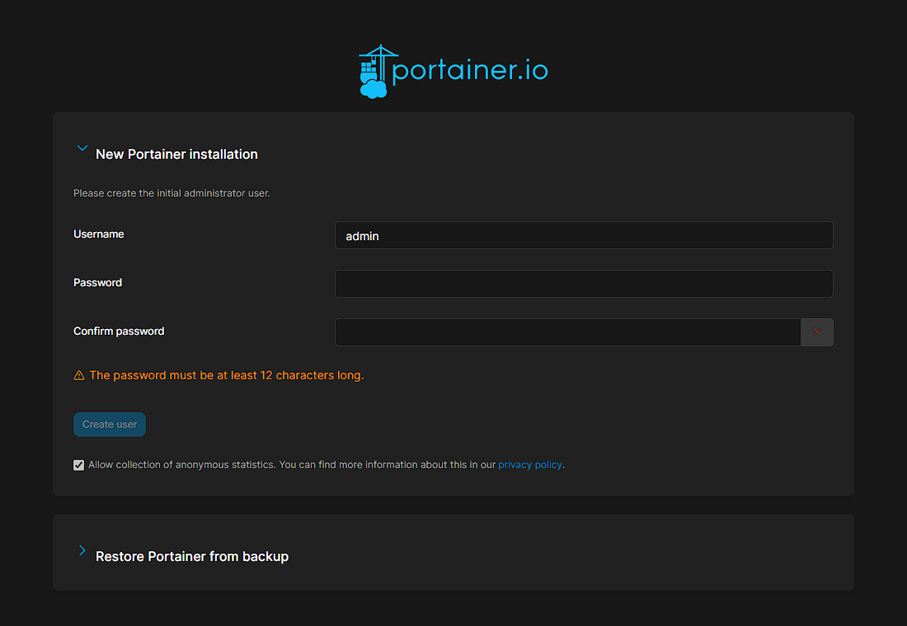
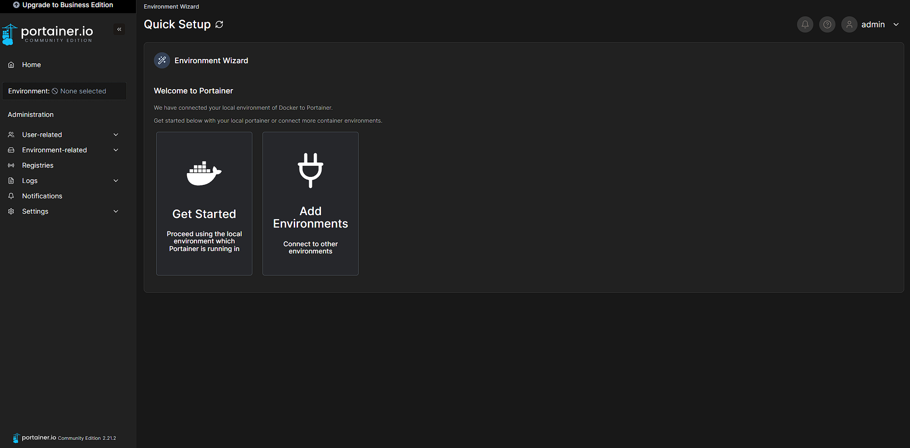
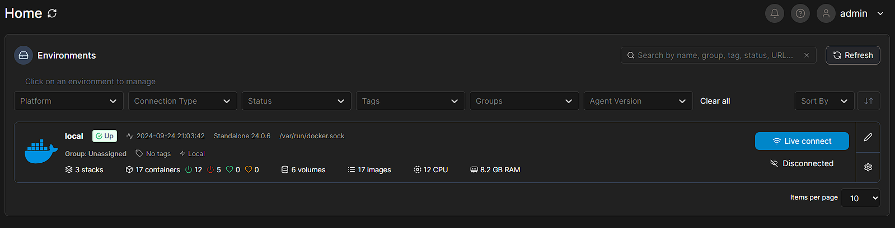
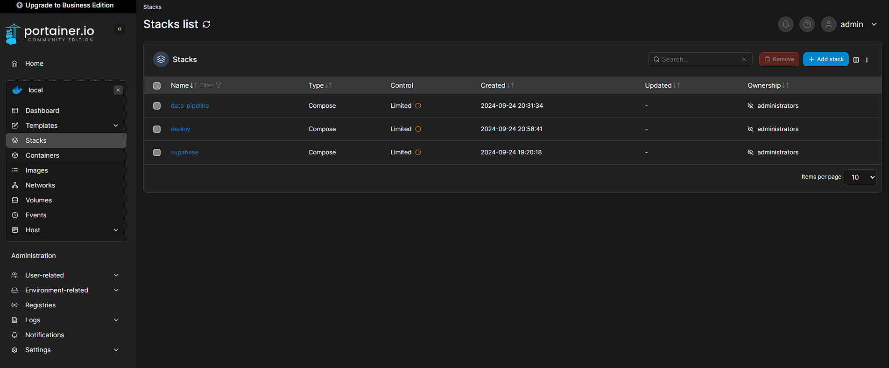
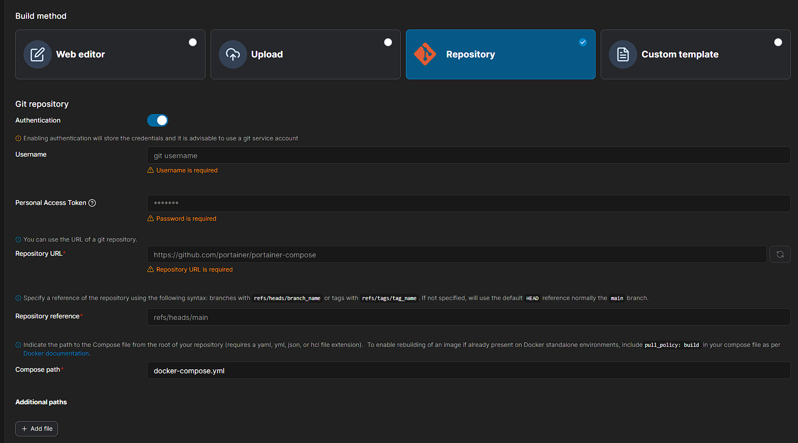

# Como rodar
### Abra a pasta deploy no terminal

### Instale o Make

#### Windows:
```
https://gnuwin32.sourceforge.net/packages/make.htm
```

#### Linux/Mac:
```
sudo apt install make
```

### Crie o .env e troque as senhas

#### Linux:
```
make copy
```
#### Windows:
```
make copy-w
```
**Atenção:** Será criado .env na pasta deploy

### Rode o comando para iniciar o portainer:
```
make up
```

### Se der erro de privilégio, rodar:
```
make up-priv
```

### Caso não queira usar o make, adicione o .env e rode:
```
docker-compose up
```

**Atenção 1:** É necessário que o Docker esteja executando na máquina 

**Atenção 2:** Para o uso do make é necessário ter ele instalado

### Acesse no navegador:
```
localhost:9000
```

### Crie sua conta no Portainer:


### Conecte o Docker clicando em "Get Started":


### Acesse o Docker Local:


### Depois acesse a stack no menu lateral e clique no botão "+ add stack":


### Conecte-se ao repositório e adicione o .env:


#### Nessa etapa, passe as seguintes informações:
- username github
- token github
- url do repositório: https://github.com/Inteli-College/2024-2A-T03-ES11-G01
- compose path: src/data_pipeline/infra/docker-compose.yml
- adicione o .env e mude as senhas

#### Por fim, faça o deploy da stack.

## Uma versão simplificada de uso local e sem uso de orquestração de containers se encontra em src/infra/